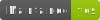
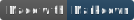
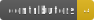
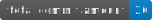

<link rel="preconnect" href="https://fonts.gstatic.com">
<link href="https://fonts.googleapis.com/css2?family=Cardo&family=Oswald&display=swap" rel="stylesheet">

<section class="section__hero" id="hero" align="center" valign="middle">
	<br />
	<h1 class="hero__heading"  align="center" valign="middle">Project Marcel Teugels</h1>
	<br />
	<div class="hero__content" align="center" valign="middle">
		<p class="technologies__info" align="center" valign="middle">
			<a
				target="_blank"
				rel="noopener noreferrer"
				href="https://GitHub.com/Naereen/StrapDown.js/graphs/commit-activity"
			>
				
			</a>
			<a
				target="_blank"
				rel="noopener noreferrer"
				href="http://commonmark.org"
			>
				
			</a>
			<a
				target="_blank"
				rel="noopener noreferrer"
				href="https://github.com/RafVergauwen?tab=followers"
			>
				
			</a>
			<a
				target="_blank"
				rel="noopener noreferrer"
				href="https://www.gnu.org/licenses/gpl-3.0"
			>
				
			</a>
			<a
				target="_blank"
				rel="noopener noreferrer"
				href="https://github.com/RafVergauwen/project-marsteel/commit/main"
			>
				
			</a>
		</p>
		<p class="hero__quote">
			<i>"One machine can do the work of 50 ordinary men.</i>
			<i>No machine can do the work of one extraordinary men"</i>
		</p>
		<p class="hero__git" align="center" valign="middle">
			<a
				target="_blank"
				rel="noopener noreferrer"
				href="https://GitHub.com/RafVergauwen/project-marsteel/stargazers/"
				style="text-decoration: none;"
			>
				
			</a>
			<a
				target="_blank"
				rel="noopener noreferrer"
				href="https://GitHub.com/RafVergauwen/project-marsteel/watchers/"
				style="text-decoration: none;"
			>
				
			</a>
			<a
				target="_blank"
				rel="noopener noreferrer"
				href="https://github.com/RafVergauwen?tab=followers"
				style="text-decoration: none;"
			>
				
			</a>
			<a
				target="_blank"
				rel="noopener noreferrer"
				href="https://GitHub.com/RafVergauwen/project-marsteel/fork"
				style="text-decoration: none;"
			>
				
			</a>
			<a
				target="_blank"
				rel="noopener noreferrer"
				href="https://GitHub.com/RafVergauwen/project-marsteel/network/"
				style="text-decoration: none;"
			>
				
			</a>
		</p>
		<p class="hero__contributors" align="center" valign="middle">
			<a
				target="_blank"
				rel="noopener noreferrer"
				href="https://github.com/EmielTeugels"
				style="text-decoration: none;"
				>&#183;E. Teugels&#183;</a
			>
			<a
				href="https://www.facebook.com/emiel.teugels/"
				target="_blank"
				rel="noopener noreferrer"
				style="text-decoration: none;"
				></a>
			<a
				href="https://github.com/KennethBlondeel"
				target="_blank"
				rel="noopener noreferrer"
				style="text-decoration: none;"
				>&#183;K. Blondeel&#183;</a
			>
			<a
				href="https://www.facebook.com/kenneth.blondeel/"
				target="_blank"
				rel="noopener noreferrer"
				style="text-decoration: none;"
				></a>
			<a
				href="https://github.com/LinsTimperman"
				target="_blank"
				rel="noopener noreferrer"
				style="text-decoration: none;"
				>&#183;L. Timperman&#183;</a
			>
			<a
				href="https://www.facebook.com/lins.timperman.3/"
				target="_blank"
				rel="noopener noreferrer"
				style="text-decoration: none;"
				></a>
			<a
				href="https://github.com/RafVergauwen"
				target="_blank"
				rel="noopener noreferrer"
				style="text-decoration: none;"
				>&#183;R. Vergauwen&#183;</a
			>
			<a
				href="https://www.facebook.com/raf.vergauwen/"
				target="_blank"
				rel="noopener noreferrer"
				style="text-decoration: none;"
				></a>
		</p>
		<p  align="center" valign="middle">
			<a href="https://www.instagram.com/marcelteugels/" style="text-decoration: none;">
					Experience true craftsmanship »
				</a>
		</p>
			<br />
			<br />
			<p class="hero__logo align="center" valign="middle">
				<a href="https://github.com/RafVergauwen/project-marsteel">
					
				</a>
		</p>
			<br />
			<br />
	</div>
	<div class="technologies__content" align="center" valign="middle">
		<p class="technologies__languages" align="center" valign="middle">
			<a href="https://developer.mozilla.org/en-US/docs/Web/CSS/Reference" target="_blank" rel="noopener noreferrer">
				
			</a>
			<a href="https://developer.mozilla.org/en-US/docs/Web/HTML/Element" target="_blank" rel="noopener noreferrer">
				
			</a>
			<a href="https://javascript.info" target="_blank" rel="noopener noreferrer">
				
			</a>
			<a href="https://vuejs.org" target="_blank" rel="noopener noreferrer">
				
			</a>
			<a href="https://sass-lang.com/documentation" target="_blank" rel="noopener noreferrer">
				
			</a>
			<a href="https://www.mysqltutorial.org/" target="_blank" rel="noopener noreferrer">
				
			</a>
			<a href="https://www.mongodb.com/" target="_blank" rel="noopener noreferrer">
				
			</a>
		</p>
		<p class="technologies__gag" align="center" valign="middle">
			<a
				target="_blank"
				rel="noopener noreferrer"
				href="http://commonmark.org"
			>
				
			</a>
			<a
				target="_blank"
				rel="noopener noreferrer"
				href="https://github.com/RafVergauwen?tab=followers"
			>
				
			</a>
			<a
				target="_blank"
				rel="noopener noreferrer"
				href="https://GitHub.com/Naereen/StrapDown.js/graphs/commit-activity"
			>
				
			</a>
		</p>
	</div>
	<br />
</section>

## **Intro**

### **Beschrijving**

> Het project is onderverdeeld in twee delen, een restoratie gedeelte en een verkoopgedeelte.
> Voorbeeld: https://remmen.be/
> Switchen van het ene deel naar het andere deel is mogelijk.

### **Roles**

* Korneel Eeckhout : Prestigious Project Patriarch
* Emiel Teugels : Driven Database Director
* Raf Vergauwen : Glorious Git Governor
* Kenneth Blondeel : Illustrious Illustration Inventor
* Lins Timperman : Suitable Support Sidekick

### **Build Setup**

```bash
# install dependencies
$ npm install

# serve with hot reload at localhost:3000
$ npm run dev

# build for production and launch server
$ npm run build
$ npm run start

# generate static project
$ npm run generate
```

For detailed explanation on how things work, check out [Nuxt.js docs](https://nuxtjs.org).

## **Stuctuur van Deel 1: Restoratie**

---

### **Homepagina**

> _Kortere versie van heel het restoratie gedeelte_

---

#### _Header (sticky)_

- [ ] Logo
- [ ] Navigatie
  - _Home_
  - _Restoratie_
  - _Workshops_
  - _Contact_
- [ ] Link naar ander deel

#### _Hero_

- [ ] Inspirerende quote
- [ ] Link naar ander deel

#### _Conservatie en restoratie_

- [ ] Korte versie
- [ ] Link conservatiegedeelte van de website

#### _Voorstelling_

- [ ] Portfolio

#### _Workshops_

- [ ] Korte uitleg
- [ ] Link workshopgedeelte van de website

#### **Contact**

- [ ] Link contactgedeelte van de website

#### _Footer_

- [ ] Sociale media
- [ ] Contact

### **Restoratie en Conservatie**

> _Uitleg over restoratie-diensten en processen die worden aangeboden_

---

#### _Header (sticky)_

- [ ] Logo
- [ ] Navigatie
  - _Home_
  - _Restoratie_
  - _Workshops_
  - _Contact_
- [ ] Link naar ander deel

#### _Restoratie houtwerk_

- [ ] Meubels
- [ ] Beeldhouwwerk
- [ ] Etnografie
- [ ] Restoratie smeedwerk
  - _Algemeen_
- [ ] Restoratie taxidermie

#### _Footer_

- [ ] Sociale media
- [ ] Contact

### **Workshops**

> _Uitleg over workshops die worden aangeboden_

---

#### _Header (sticky)_

- [ ] Logo
- [ ] Navigatie
  - _Home_
  - _Restoratie_
  - _Workshops_
  - _Contact_
- [ ] Link naar ander deel

#### _Uitleg welke soort workshops_

#### _Al gegeven workshops_

#### _Footer_

- [ ] Sociale media
- [ ] Contact

### **Contact**

> _Toegang tot alle contact info_

---

#### _Header (sticky)_

- [ ] Logo
- [ ] Navigatie
  - _Home_
  - _Restoratie_
  - _Workshops_
  - _Contact_
- [ ] Link naar ander deel

#### _Contactformulier_

- [ ] Naam
- [ ] Email
- [ ] Telefoonnummer
- [ ] Categorie
  - _Restoratie_
  - _Conservatie_
  - _Workshop_
  - _Andere_
- [ ] Categorie
  - _Hout_
  - _Smeedwerk_
  - _Taxidermie_
  - _Andere_
- [ ] Bericht

#### _Persoonlijke contactgegevens_

- [ ] Locatie atelier
- [ ] Persoonlijke gegevens

#### _Footer_

- [ ] Sociale media
- [ ] Contact

## **Structuur van Deel 2: Webshop**

---

### **Homepagina**

> _Kortere versie van heel het webshop gedeelte_

---

#### _Header_

- [ ] Logo
- [ ] Navigatie
  - _Home_
  - _Webshop_
  - _Custom work_
- [ ] Login
- [ ] Link naar ander deel

#### _Hero_

- [ ] Inspirerende quote
- [ ] Link naar ander deel

#### _New and hot items_

- [ ] Link naar webshop

#### _Voorstelling_

#### _Footer_

- _Sociale media_
- _Contactgegevens?!_

### **Webshop**

> _Onderdelen van het webshop gedeelte_

---

#### _Header_

- [ ] Logo
- [ ] Navigatie
  - _Home_
  - _Webshop_
  - _Custom work_
- [ ] Login
- [ ] Link naar ander deel

#### _Grid van Tiles_

- [ ] Foto
- [ ] Beschrijving
- [ ] Prijs
- [ ] Rating

#### _Footer_

- [ ] Sociale media
- [ ] Contactgegevens?!

### **Custom Work**

> _Onderdelen van het custom work gedeelte_

---

#### _Header_

- [ ] Logo
- [ ] Navigatie
  - _Home_
  - _Webshop_
  - _Custom work_
- [ ] Login
- [ ] Link naar ander deel

#### _Formulier voor custom items_

- [ ] Naam
- [ ] Email
- [ ] Adress
- [ ] Categorien
- [ ] Tekstbeschrijving
- [ ] Vragen aan klant
- [ ] Wip

#### _Footer_

- [ ] Sociale media
- [ ] Contactgegevens?!

<style>
	* {
		color: white;
	}
	a {
		text-decoration: none;
		font-family: 'Cardo', serif;
		font-variant: small-caps;
		color: teal;
		font-size: 1.2em;
	}
	h1 {
		font-family: 'Oswald', sans-serif;

	}
	section {
		background: url("https://images.unsplash.com/photo-1533035350251-aa8b8e208d95?ixid=MXwxMjA3fDB8MHxwaG90by1wYWdlfHx8fGVufDB8fHw%3D&ixlib=rb-1.2.1&auto=format&fit=crop&w=934&q=80")
			center center / cover no-repeat content-box;
		border-radius: 1rem;
	}
	.arm {
			color: red;
		}
	.section__hero {
		}
	.hero__content {
	}
	.hero__contributors {
	}
	.hero__quote {
		font-size: 1.35rem;
		font-family: serif;
	}
	.hero__logo {
	}
	.technologies__content {
	}
	.technologies__languages{
	}
	.technologies__info {
	}
	.technologies__gag {
	}
	.technologies__badges {
	}


</style>
