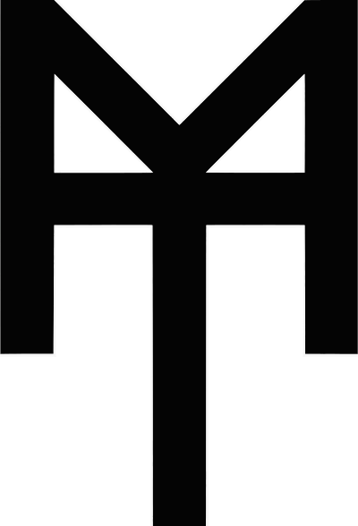

#

 
 

  

 
 

<h1 align="center">Project Marcel Teugels</h1>

  <i class="quote">"One machine can do the work of 50 ordinary men.</i>
  <i class="quote">No machine can do the work of one extraordinary men"</i>
   
	 
  <a href="https://www.instagram.com/marcelteugels/"><strong class="link-instagram">Experience true craftsmanship »</strong></a>
   
	 

   
  <a href="https://github.com/EmielTeugels" target="_blank">&#160;&#8729; Emiel Teugels &#8729;&#160;</a>
  
  <a href="https://github.com/KennethBlondeel" target="_blank">&#160;&#8729; Kenneth Blondeel &#8729;&#160;</a>
  
  <a href="https://github.com/LinsTimperman" target="_blank">&#160;&#8729; Lins Timperman &#8729;&#160;</a>
  
  <a href="https://github.com/RafVergauwen" target="_blank">&#160;&#8729; Raf Vergauwen &#8729;&#160;</a>
	
	 
	 
	 

## **Intro**

### **Leden**

- Emiel: Teamleader
- Kenneth: Graphical Designer
- Raf: Support
- Lins : Support

### **Beschrijving**

Het project is onderverdeeld in twee delen, een restoratie gedeelte en een verkoopgedeelte.
Voorbeeld: https://remmen.be/
Switchen van het ene deel naar het andere deel is mogelijk.

## **Stuctuur van Deel 1: Restoratie**

### **Homepagina**

Kortere versie van heel het restoratie gedeelte.

- Header (sticky)

  - Logo
  - Navigatie
    - Home
    - Restoratie
    - Workshops
    - Contact
  - link naar ander deel

- Hero

  - inspirerende quote
  - link naar ander deel

- Conservatie en restoratie

  - korte versie
  - link conservatiegedeelte van de website

- Voorstelling

  - Portfolio

- Workshops

  - korte uitleg
  - link workshopgedeelte van de website

- Contact

  - link contactgedeelte van de website

- footer
  - sociale media
  - contact

### **Restoratie en Conservatie**

Uitleg over restoratie-diensten en processen die worden aangeboden.

- Header (sticky)

  - Logo
  - Navigatie
    - Home
    - Restoratie
    - Workshops
    - Contact
  - link naar ander deel

- Restoratie houtwerk

  - Meubels
  - Beeldhouwwerk
  - Etnografie
  - Restoratie smeedwerk
    - Algemeen
  - Restoratie taxidermie

- footer
  - sociale media
  - contact

### **Workshops**

- Header (sticky)

  - Logo
  - Navigatie
    - Home
    - Restoratie
    - Workshops
    - Contact
  - link naar ander deel

- Uitleg welke soort workshops
- Al gegeven workshops

- footer
  - sociale media
  - contact

### **Contact**

- Header (sticky)

  - Logo
  - Navigatie
    - Home
    - Restoratie
    - Workshops
    - Contact
  - link naar ander deel

- Contactformulier
  - Naam
  - email
  - telefoonnummer
  - categorie
    - restoratie
    - conservatie
    - workshop
    - andere
  - categorie
    - hout
    - smeedwerk
    - taxidermie
    - andere
  - bericht
- Persoonlijke contactgegevens

  - locatie atelier
  - persoonlijke gegevens

- footer
  - sociale media
  - contact

## **Structuur van Deel 2: Webshop**

### **Homepagina**

- Header

  - logo
  - navigatie
    - Home
    - webshop
    - custom work
  - login
  - link naar ander deel

- Hero

  - inspirerende quote
  - link naar ander deel

- New and hot items

  - link naar webshop

- Voorstelling

- footer
  - sociale media
  - contactgegevens?!

### **Webshop**

- Header

  - logo
  - navigatie
    - Home
    - webshop
    - custom work
  - login
  - link naar ander deel

- Grid van Tiles

  - Foto
  - beschrijving
  - prijs
  - rating

- footer
  - sociale media
  - contactgegevens?!

### **Custom Work**

- Header

  - logo
  - navigatie
    - Home
    - webshop
    - custom work
  - login
  - link naar ander deel

- formulier voor custom items

  - naam
  - email
  - adress
  - categorien
  - tekstbeschrijving
  - vragen aan klant
  - wip

- footer
  - sociale media
  - contactgegevens?!

