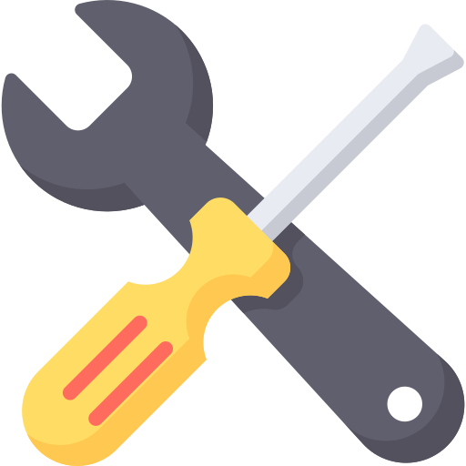

<h1 class="hero__title" align="center">
  ⚒️ &nbsp; Project Marcel Teugels &nbsp; 🛠️
</h1>
<br />
<div class="hero__github-badges" align="center">
  
  
  
  
  
  
  
  
</div>
<br />
<div class="hero__main" align="center">
  <i>"One machine can do the work of 50 ordinary men.</i>
  <i>No machine can do the work of one extraordinary men."</i>
  <br />
  <br />
  <br />
  <br />
  
  <br />
  <br />
  <br />
  <br />
  <blockquote>
    <b>
    A personal website for Marcel Teugels, a young passionate blacksmith who
    mainly deals with restoration and handmade assignments. The website consists of 2 parts.
    A restoration area for normal repairs and a sale personal section for handmade creations.
    <b/>
  </blockquote>
</div>
 <br />
 <br />

<!-- - Validator.js -->
<!-- - Vuedraggable.js -->
<!-- - Popper.js -->
<!-- - Anime.js -->
<!-- - Husky.js -->
<!-- - Editorconfig -->
<!-- - Commitlint -->
<!-- - Markdownlint -->
<!-- - Lint staged -->
<!-- - Axios.js -->
<!-- - Vuex.js -->
<!-- - Lodash.js -->
<!-- - Async.js -->
<!-- - Moment.js -->
<!-- - Chalk.js -->
<!-- - Dotenv.js -->

---

##  &nbsp; **Table of Contents** <!-- {#root-toc} -->

<br/>

###  &nbsp; **A - Main Content** <!-- {#toc-main} -->

---

- [ &nbsp; **Table of Contents**](#-nbsp-table-of-contents-nbsp-)
- [ &nbsp; **Technology Stack**](#-nbsp-project-technology-stack-nbsp-)
- [ &nbsp; **Installation**](#-nbsp-project-installation-nbsp-)
- [ &nbsp; **Configuration**](#-nbsp-project-config-nbsp-)
- [ &nbsp; **Conventions & Styles**](#-nbsp-project-conventions--styles-nbsp-)
- [ &nbsp; **Rules**](#-nbsp-project-rules-nbsp-)
- [ &nbsp; **Architecture**](#-nbsp-project-architecture-nbsp-)
- [ &nbsp; **Testing**](#-nbsp-project-testing-nbsp-)
- [ &nbsp; **Website Usage**](#-nbsp-website-usage-nbsp-)
- [ &nbsp; **Git**](#-nbsp-git-basics-nbsp-)
- [ &nbsp; **Tools & Utilities**](#-nbsp-tools-and-utilities-nbsp-)
- [ &nbsp; **Authors & Contributors**](#-nbsp-authors-and-contributors-nbsp-)
- [ &nbsp; **Development Changelog**](#-nbsp-development-changelog-nbsp-)
- [ &nbsp; **Legal License**](#-nbsp-legal-license-nbsp-)

<br/>

###  &nbsp; **B - Extended Content** <!-- {#toc-extended} -->

---

<details>
  <summary><i> Collapse Extended - Table Of Contents </i></summary>

---

<br/>

- [ &nbsp; **Table of Contents**](#--table-of-contents)
  - [ &nbsp; **A - Main Content**](#--a---main-content)
  - [ &nbsp; **B - Extended Content**](#--b---extended-content)
- [ &nbsp; **Technology Stack**](#--technology-stack)
  - [ &nbsp; **A - Main Content**](#--a---main-content-1)
  - [ &nbsp; **B - Extended Content**](#--b---extended-content-1)
    - [_B1 ❖ &nbsp; Main Technologies_](#b1---main-technologies)
    - [_B2 ❖ &nbsp; Frameworks_](#b2---frameworks)
    - [_B3 ❖ &nbsp; Database Tools_](#b3---database-tools)
    - [_B4 ❖ &nbsp; Extentions_](#b4---extentions)
      - [**NPM Extentions:** Formatters, Linters, and Extentions](#npm-extentions-formatters-linters-and-extentions)
      - [**VSCODE Exclusive Extentions:** Formatters, Linters and Extentions](#vscode-exclusive-extentions-formatters-linters-and-extentions)
- [ &nbsp; **Installation**](#--installation)
  - [ &nbsp; **A - Main Content**](#--a---main-content-2)
  - [ &nbsp; **B - Extended Content**](#--b---extended-content-2)
    - [_B1 ❖ &nbsp; Subcategory I_](#b1---subcategory-i)
    - [_B2 ❖ &nbsp; Subcategory II_](#b2---subcategory-ii)
    - [_B3 ❖ &nbsp; Subcategory III_](#b3---subcategory-iii)
- [ &nbsp; **Configuration**](#--configuration)
  - [ &nbsp; **A - Main Content**](#--a---main-content-3)
  - [ &nbsp; **B - Extended Content**](#--b---extended-content-3)
    - [_B1 ❖ &nbsp; Subcategory I_](#b1---subcategory-i-1)
    - [_B2 ❖ &nbsp; Subcategory II_](#b2---subcategory-ii-1)
    - [_B3 ❖ &nbsp; Subcategory III_](#b3---subcategory-iii-1)
- [ &nbsp; **Conventions & Styles**](#--conventions--styles)
  - [ &nbsp; **A - Main Content**](#--a---main-content-4)
  - [ &nbsp; **B - Extended Content**](#--b---extended-content-4)
    - [_B1 ❖ &nbsp; Subcategory I_](#b1---subcategory-i-2)
    - [_B2 ❖ &nbsp; Subcategory II_](#b2---subcategory-ii-2)
    - [_B3 ❖ &nbsp; Subcategory III_](#b3---subcategory-iii-2)
- [ &nbsp; **Rules**](#--rules)
  - [ &nbsp; **A - Main Content**](#--a---main-content-5)
  - [ &nbsp; **B - Extended Content**](#--b---extended-content-5)
    - [_B1 ❖ &nbsp; Subcategory I_](#b1---subcategory-i-3)
    - [_B2 ❖ &nbsp; Subcategory II_](#b2---subcategory-ii-3)
    - [_B3 ❖ &nbsp; Subcategory III_](#b3---subcategory-iii-3)
- [ &nbsp; **Architecture**](#--architecture)
  - [ &nbsp; **A - Main Content**](#--a---main-content-6)
  - [ &nbsp; **B - Extended Content**](#--b---extended-content-6)
    - [ ⚜ **.github** ⚜ _Collaborative version control and source code management_](#--github--collaborative-version-control-and-source-code-management)
    - [ ⚜ **.nuxt** ⚜ _So-called build directory, dynamically generated and hidden by default_](#--nuxt--so-called-build-directory-dynamically-generated-and-hidden-by-default)
    - [ ⚜ **.vscode** ⚜ _Freeware source-code editor made by Microsoft_](#--vscode--freeware-source-code-editor-made-by-microsoft)
    - [ ⚜ **archive** ⚜ _Accumulation of historical records_](#--archive--accumulation-of-historical-records)
    - [ ⚜ **assets** ⚜ _Placeholder description_](#--assets--placeholder-description)
    - [ ⚜ **components** ⚜ _Placeholder description_](#--components--placeholder-description)
    - [ ⚜ **config** ⚜ _Placeholder description_](#--config--placeholder-description)
    - [ ⚜ **content** ⚜ _Placeholder description_](#--content--placeholder-description)
    - [ ⚜ **docs** ⚜ _Placeholder description_](#--docs--placeholder-description)
    - [ ⚜ **layouts** ⚜ _Placeholder description_](#--layouts--placeholder-description)
    - [ ⚜ **middleware** ⚜ _Placeholder description_](#--middleware--placeholder-description)
    - [ ⚜ **node_modules** ⚜ _Placeholder description_](#--node_modules--placeholder-description)
    - [ ⚜ **pages** ⚜ _Placeholder description_](#--pages--placeholder-description)
    - [ ⚜ **plugins** ⚜ _Placeholder description_](#--plugins--placeholder-description)
    - [ ⚜ **src** ⚜ _Placeholder description_](#--src--placeholder-description)
    - [ ⚜ **static** ⚜ _Placeholder description_](#--static--placeholder-description)
    - [ ⚜ **store** ⚜ _Placeholder description_](#--store--placeholder-description)
    - [ ⚜ **test** ⚜ _Placeholder description_](#--test--placeholder-description)
    - [ ⚜ **tools** ⚜ _Placeholder description_](#--tools--placeholder-description)
    - [ ⚜ **utilities** ⚜ _Placeholder description_](#--utilities--placeholder-description)
- [ &nbsp; **Testing**](#--testing)
  - [ &nbsp; **A - Main Content**](#--a---main-content-7)
  - [ &nbsp; **B - Extended Content**](#--b---extended-content-7)
    - [_B1 ❖ &nbsp; Subcategory I_](#b1---subcategory-i-4)
    - [_B2 ❖ &nbsp; Subcategory II_](#b2---subcategory-ii-4)
    - [_B3 ❖ &nbsp; Subcategory III_](#b3---subcategory-iii-4)
- [ &nbsp; **Website Usage**](#--website-usage)
  - [ &nbsp; **A - Main Content**](#--a---main-content-8)
  - [ &nbsp; **B - Extended Content**](#--b---extended-content-8)
    - [_B1 ❖ &nbsp; Subcategory I_](#b1---subcategory-i-5)
    - [_B2 ❖ &nbsp; Subcategory II_](#b2---subcategory-ii-5)
    - [_B3 ❖ &nbsp; Subcategory III_](#b3---subcategory-iii-5)
- [ &nbsp; **Git**](#--git)
  - [ &nbsp; **A - Main Content**](#--a---main-content-9)
  - [ &nbsp; **B - Extended Content**](#--b---extended-content-9)
    - [_B1 ❖ &nbsp; Example: Contribute to an existing repository_](#b1---example-contribute-to-an-existing-repository)
    - [_B2 ❖ &nbsp; Example: Start a new repository and publish it to GitHub_](#b2---example-start-a-new-repository-and-publish-it-to-github)
    - [_B3 ❖ &nbsp; Example: contribute to an existing branch on GitHub_](#b3---example-contribute-to-an-existing-branch-on-github)
- [ &nbsp; **Tools & Utilities**](#--tools--utilities)
  - [ &nbsp; **A - Main Content**](#--a---main-content-10)
  - [ &nbsp; **B - Extended Content**](#--b---extended-content-10)
    - [_B1 ❖ &nbsp; Subcategory I_](#b1---subcategory-i-6)
    - [_B2 ❖ &nbsp; Subcategory II_](#b2---subcategory-ii-6)
    - [_B3 ❖ &nbsp; Subcategory III_](#b3---subcategory-iii-6)
- [ &nbsp; **Authors & Contributors**](#--authors--contributors)
  - [ &nbsp; **A - Main Content**](#--a---main-content-11)
  - [ &nbsp; **B - Extended Content**](#--b---extended-content-11)
    - [_B1 ❖ &nbsp; Subcategory I_](#b1---subcategory-i-7)
    - [_B2 ❖ &nbsp; Subcategory II_](#b2---subcategory-ii-7)
    - [_B3 ❖ &nbsp; Subcategory III_](#b3---subcategory-iii-7)
- [ &nbsp; **Development Changelog**](#--development-changelog)
  - [ &nbsp; **A - Main Content**](#--a---main-content-12)
  - [ &nbsp; **B - Extended Content**](#--b---extended-content-12)
    - [_B1 ❖ &nbsp; Subcategory I_](#b1---subcategory-i-8)
    - [_B2 ❖ &nbsp; Subcategory II_](#b2---subcategory-ii-8)
    - [_B3 ❖ &nbsp; Subcategory III_](#b3---subcategory-iii-8)
- [ &nbsp; **Legal License**](#--legal-license)
  - [ &nbsp; **A - Main Content**](#--a---main-content-13)
  - [ &nbsp; **B - Extended Content**](#--b---extended-content-13)

<br/>

</details>

<br/>
<br/>
<br/>
<br/>

##  &nbsp; **Technology Stack** <!-- {#root-techstack} -->

<br/>

###  &nbsp; **A - Main Content** <!-- {#techstack-main} -->

---

<div class="hero__tech-stack" align="center">
  <a href="https://github.com/raf-vergauwen/project-marcel-teugels/">
  
  </a>
  <a href="https://code.visualstudio.com/">
   
  </a>
  <a href="https://www.adobe.com/products/xd.html">
   
  </a>
  <a href="https://affinity.serif.com/en-us/photo/">
   
  </a>
  <a href="https://mattermost.com/">
   
  </a>
  <a href="https://www.messenger.com/">
   
  </a>
  <a href="https://git-scm.com/">
   
  </a>
  <a href="https://commonmark.org/">
   
  </a>
  <a href="https://developer.mozilla.org/en-US/docs/Web/Guide/HTML/HTML5">
   
  </a>
  <a href="https://developer.mozilla.org/en-US/docs/Web/CSS">
   
  </a>
  <a href="https://developer.mozilla.org/en-US/docs/Web/javascript">
   
  </a>
  <a href="https://www.json.org/json-en.html">
   
  </a>
  <a href="https://www.postgresql.org/">
   
  </a>
  <a href="https://www.typescriptlang.org/">
   
  </a>
  <a href="https://sass-lang.com/dart-sass">
   
  </a>
  <a href="https://vuejs.org/">
   
  </a>
  <a href="https://nuxtjs.org/">
   
  </a>
  <a href="https://buefy.org/">
   
  </a>
  <a href="https://mochajs.org/">
   
  </a>
  <a href="https://pugjs.org/api/getting-started.html">
   
  </a>
  <a href="https://jestjs.io/">
   
  </a>
  <a href="https://babeljs.io/">
   
  </a>
  <a href="https://webpack.js.org/">
   
  </a>
  <a href="https://prettier.io/">
   
  </a>
  <a href="https://eslint.org/">
   
  </a>
  <a href="https://prettier.io/">
   
  </a>
  <a href="https://www.chartjs.org/">
   
  </a>
  <a href="https://storybook.js.org/">
   
  </a>
  <a href="https://d3js.org/">
   
  </a>
  <a href="https://insomnia.rest/">
   
  </a>
  <a href="https://directus.io/">
   
  </a>
  <a href="https://supabase.io">
   
  </a>
  <br />
</div>

<br/>

###  &nbsp; **B - Extended Content** <!-- {#techstack-extended} -->

---

<details>
  <summary><i>Collapse Extended - Technology Stack</i></summary>

---

<br/>

#### _B1 ❖ &nbsp; Main Technologies_

---

| **Logo**                                                                                   | **Name**         | **Technology Category**   | **Fundamental Concepts**                      | **Standards**     | **Supersets**    | **Frameworks**      | **Documentation guide** | **Style guide**    |
| ------------------------------------------------------------------------------------------ | ---------------- | ------------------------- | --------------------------------------------- | ----------------- | ---------------- | ------------------- | ----------------------- | ------------------ |
|                 | **[Git]**        | [Version Control System]  | [Open source] [default git features].         | [Git:2.31]        | null             | null                | [Git documentation]     | [Git style guide]  |
|                | **[XML]**        | [Markup language]         | [Metalanguage] for making markup languages.   | [XML:1.1]         | null             | null                | [XML documentation]     | [XML style guide]  |
|  | **[Markdown]**   | [Markup language]         | Universal [lightweight document markup].      | [CommonMark:0.29] | [Markdown-it]    | null                | [MD documentation]      | [MD style guide]   |
|             | **[HTML]**       | [Markup language]         | Universal [web document markup].              | [HTML:5]          | ~~[XHTML]~~      | [Vue.js], [Nuxt.js] | [HTML documentation]    | [HTML style guide] |
|                | **[CSS]**        | [Style sheet language]    | [Cascading Sheet Style] language.             | [CSS:3]           | [SCSS]           | [Buefy.js]          | [CSS documentation]     | [CSS style guide]  |
|            | **[JavaScript]** | [Programming language]    | [High-level], [dynamic] and [multi-paradigm]. | [ECMAScript:2020] | ~~[TypeScript]~~ | [Vue.js], [Nuxt.js] | [JS documentation]      | [JS style guide]   |
|          | **[SQL]**        | [Query language]          | [Domain-specific Language] in [RDBMS].        | [SQL:2016]        | [PostGresql]     | [Supabase.io]       | [SQL documentation]     | [SQL style guide]  |
|              | **[JSON]**       | [Data interchange format] | File and [data interchange format].           | [JSON:ECMA-404]   | [YAML]           | null                | [JSON documentation]    | [JSON style guide] |

<br/>

#### _B2 ❖ &nbsp; Frameworks_

---

| **Logo**                                                                              | **Name**       | **Belongs Too** | **Fundamental Concepts**              | **Features**                                                                   | **Standard**  | **Documentation**     | **Style guide**     |
| ------------------------------------------------------------------------------------- | -------------- | --------------- | ------------------------------------- | ------------------------------------------------------------------------------ | ------------- | --------------------- | ------------------- |
|     | **[Vue.js]**   | [JavaScript]    | [frontend] [client-side] [framework]. | [Open source], ~~[TypeScript]~~, [MVVM], [UI], [SPA]                           | [Vue:2.6.11]  | [Vue documentation]   | [Vue style guide]   |
|  | **[Nuxt.js]**  | [JavaScript]    | [frontend] [back-side] [WAF].         | [Open source], ~~[TypeScript]~~, [Vue.js], [Node.js], [Webpack.js], [Babel.js] | [Nuxt:2.15.4] | [Nuxt documentation]  | [Nuxt style guide]  |
|      | **[Buefy.js]** | [CSS]           | [frontend] [CSS] [framework].         | [Open source], [lightweight], [UI-Components], html & css only, design         | [Buefy:0.9.6] | [Buefy documentation] | [Buefy style guide] |

<br/>

#### _B3 ❖ &nbsp; Database Tools_

---

| **Logo**                                                                                   | **Name**          | **Fundamental Concepts**                     | **Features**                                                        | **Standard**        | **Documentation**        | **Style guide**        |
| ------------------------------------------------------------------------------------------ | ----------------- | -------------------------------------------- | ------------------------------------------------------------------- | ------------------- | ------------------------ | ---------------------- |
|        | **[Github]**      | [Distributed collaborative version control]. | private, [source code management], [access control]                 | [Github:standard]   | [Github documentation]   | [Github style guide]   |
|  | **[Insomnia.io]** | [Representational State Transfer Client].    | [open source], [REST API]                                           | [Insomnia:2021.2.2] | [Insomnia documentation] | [Insomnia style guide] |
|  | **[Directus.io]** | [Headless Content Management System].        | [open source], [GraphQL], [REST API]                                | [Directus:9.0.0]    | [Directus documentation] | [Directus style guide] |
|  | **[Supabase.io]** | Mobile and web app development platform.     | [open source], [database], [authentication], [storage], [functions] | [Supabase:1.11.0]   | [Supabase documentation] | [Supabase style guide] |

<br/>

#### _B4 ❖ &nbsp; Extentions_

---

<br/>

##### **NPM Extentions:** Formatters, Linters, and Extentions

---

| **Logo**                                                                                         | **Name**          | **Formatters** | **Linters**            | **Fundamental**       | **Recommended**       | **Optional**          |
| ------------------------------------------------------------------------------------------------ | ----------------- | -------------- | ---------------------- | --------------------- | --------------------- | --------------------- |
|                      | **[XML]**         | [Prettier]     | [LibXML]               | 'Work in progress...' | 'Work in progress...' | 'Work in progress...' |
|        | **[Markdown]**    | [Prettier]     | [Markdownlint]         | 'Work in progress...' | 'Work in progress...' | 'Work in progress...' |
|                   | **[HTML]**        | [Prettier]     | [HTMLHint]             | 'Work in progress...' | 'Work in progress...' | 'Work in progress...' |
|                      | **[CSS]**         | [Prettier]     | [Stylelint]            | 'Work in progress...' | 'Work in progress...' | 'Work in progress...' |
|                    | **[SCSS]**        | [Prettier]     | [Stylelint]            | 'Work in progress...' | 'Work in progress...' | 'Work in progress...' |
|  | **[JavaScript]**  | [Prettier]     | [Eslint] [Standard-js] | 'Work in progress...' | 'Work in progress...' | 'Work in progress...' |
|  | **[TypeScript]**  | [Prettier]     | [Eslint] [Standard-js] | 'Work in progress...' | 'Work in progress...' | 'Work in progress...' |
|                | **[Vue.js]**      | [Prettier]     | [Vetur]                | 'Work in progress...' | 'Work in progress...' | 'Work in progress...' |
|             | **[Nuxt.js]**     | null           | null                   | 'Work in progress...' | 'Work in progress...' | 'Work in progress...' |
|             | **[Node.js]**     | null           | null                   | 'Work in progress...' | 'Work in progress...' | 'Work in progress...' |
|           | **[Webpack.js]**  | null           | null                   | 'Work in progress...' | 'Work in progress...' | 'Work in progress...' |
|                 | **[Babel.js]**    | null           | null                   | 'Work in progress...' | 'Work in progress...' | 'Work in progress...' |
|                    | **[JSON]**        | [Prettier]     | [Jsonlint]             | 'Work in progress...' | 'Work in progress...' | 'Work in progress...' |
|                   | **[YAML]**        | [Prettier]     | [YamlLint]             | 'Work in progress...' | 'Work in progress...' | 'Work in progress...' |
|  | **[SQL]**         | null           | [Sql-lint]             | 'Work in progress...' | 'Work in progress...' | 'Work in progress...' |
|        | **[Insomnia.io]** | null           | null                   | 'Work in progress...' | 'Work in progress...' | 'Work in progress...' |
|        | **[Directus.io]** | null           | null                   | 'Work in progress...' | 'Work in progress...' | 'Work in progress...' |
|        | **[Supabase.io]** | null           | null                   | 'Work in progress...' | 'Work in progress...' | 'Work in progress...' |

<br/>

##### **VSCODE Exclusive Extentions:** Formatters, Linters and Extentions

---

| **Logo**                                                                                         | **Name**          | **Formatters** | **Linters** | **Fundamental**       | **Recommended**       | **Optional**          |
| ------------------------------------------------------------------------------------------------ | ----------------- | -------------- | ----------- | --------------------- | --------------------- | --------------------- |
|                      | **[XML]**         | null           | null        | 'Work in progress...' | 'Work in progress...' | 'Work in progress...' |
|        | **[Markdown]**    | null           | null        | 'Work in progress...' | 'Work in progress...' | 'Work in progress...' |
|                   | **[HTML]**        | null           | null        | 'Work in progress...' | 'Work in progress...' | 'Work in progress...' |
|                      | **[CSS]**         | null           | null        | 'Work in progress...' | 'Work in progress...' | 'Work in progress...' |
|                    | **[SCSS]**        | null           | null        | 'Work in progress...' | 'Work in progress...' | 'Work in progress...' |
|  | **[JavaScript]**  | null           | null        | 'Work in progress...' | 'Work in progress...' | 'Work in progress...' |
|  | **[TypeScript]**  | null           | null        | 'Work in progress...' | 'Work in progress...' | 'Work in progress...' |
|                | **[Vue.js]**      | null           | null        | 'Work in progress...' | 'Work in progress...' | 'Work in progress...' |
|             | **[Nuxt.js]**     | null           | null        | 'Work in progress...' | 'Work in progress...' | 'Work in progress...' |
|             | **[Node.js]**     | null           | null        | 'Work in progress...' | 'Work in progress...' | 'Work in progress...' |
|           | **[Webpack.js]**  | null           | null        | 'Work in progress...' | 'Work in progress...' | 'Work in progress...' |
|                 | **[Babel.js]**    | null           | null        | 'Work in progress...' | 'Work in progress...' | 'Work in progress...' |
|                    | **[JSON]**        | null           | null        | 'Work in progress...' | 'Work in progress...' | 'Work in progress...' |
|                   | **[YAML]**        | null           | null        | 'Work in progress...' | 'Work in progress...' | 'Work in progress...' |
|                | **[SQL]**         | [SQLTools]     | null        | 'Work in progress...' | 'Work in progress...' | 'Work in progress...' |
|        | **[Insomnia.io]** | null           | null        | 'Work in progress...' | 'Work in progress...' | 'Work in progress...' |
|        | **[Directus.io]** | null           | null        | 'Work in progress...' | 'Work in progress...' | 'Work in progress...' |
|        | **[Supabase.io]** | null           | null        | 'Work in progress...' | 'Work in progress...' | 'Work in progress...' |

<br/>

<!-- Technologies Links -->

[github]: https://github.com/ 'Official Github website'
[git]: https://git-scm.com/ 'Official Git website'
[xml]: https://www.w3.org/XML/ 'Official XML website'
[markdown]: https://daringfireball.net/projects/markdown/ 'Official Markdown website'
[markdown-it]: https://markdown-it.github.io/ 'Official Markdown-it website'
[xhtml]: https://developer.mozilla.org/en-US/docs/Web/Guide/HTML/XHTML 'MDN XHTML website'
[html]: https://www.w3.org/TR/2017/REC-html52-20171214/ 'Official HTML5 website'
[css]: https://www.w3.org/Style/CSS/Overview.en.html 'Official CSS website'
[scss]: https://sass-lang.com/ 'Official SASS website'
[javascript]: https://www.javascript.com/ 'Semi-official JavaScript guide'
[typescript]: https://www.typescriptlang.org/ 'Official TypeScript guide'
[sql]: https://www.mysql.com/ 'Official MySQL website'
[postgresql]: https://www.postgresql.org/ 'Official PostgreSQL website'
[json]: https://www.json.org/json-en.html 'Official JSON website'
[yaml]: https://yaml.org/ 'Best YAML Guide'
[vue.js]: https://vuejs.org/ 'Official Vue website'
[nuxt.js]: https://nuxtjs.org/ 'Official Nuxt website'
[buefy.js]: https://buefy.org/ 'Official Buefy website'
[node.js]: https://nodejs.org/en/ 'Official Node website'
[webpack.js]: https://webpack.js.org/ 'Official Webpack website'
[babel.js]: https://babeljs.io/ 'Official Babel website'
[insomnia.io]: https://insomnia.rest/ 'Official Insomnia website'
[directus.io]: https://directus.io/ 'Official Directus website'
[supabase.io]: https://supabase.io/ 'Official Supabase website'

<!-- Technology Categories Links -->

[version control system]: https://en.wikipedia.org/wiki/Version_control 'VCS wikipedia link'
[markup language]: https://en.wikipedia.org/wiki/Markup_language 'Markup language  wikipedia link'
[style sheet language]: https://en.wikipedia.org/wiki/Style_sheet_language 'Style sheet language wikipedia link'
[programming language]: https://en.wikipedia.org/wiki/Programming_language 'Programming language wikipedia link'
[query language]: https://en.wikipedia.org/wiki/Query_language 'Query language wikipedia link'
[data interchange format]: https://en.wikipedia.org/wiki/Interchange_File_Format 'File & data interchange format wikipedia link'

<!-- Fundamental Concepts Links -->

[open source]: https://en.wikipedia.org/wiki/Open_source 'Open source wikipedia link'
[default git features]: https://git-scm.com/about 'Default git features link'
[metalanguage]: https://en.wikipedia.org/wiki/Metalanguage 'Metalanguage wikipedia link'
[lightweight document markup]: https://en.wikipedia.org/wiki/Lightweight_markup_language 'Lightweight document markup wikipedia link'
[web document markup]: https://en.wikipedia.org/wiki/HTML 'Web document markup wikipedia link'
[cascading sheet style]: https://en.wikipedia.org/wiki/CSS 'CSS wikipedia link'
[high-level]: https://en.wikipedia.org/wiki/High-level_programming_language 'High-level programming wikipedia link'
[dynamic]: https://en.wikipedia.org/wiki/Type_system#DYNAMIC 'Type system wikipedia link'
[multi-paradigm]: https://en.wikipedia.org/wiki/Programming_paradigm 'Programming paradigm wikipedia link'
[domain-specific language]: https://en.wikipedia.org/wiki/Domain-specific_language 'Domain-specific language wikipedia link'
[rdbms]: https://en.wikipedia.org/wiki/Relational_database#RDBMS 'Relational database wikipedia link'
[data interchange format]: https://en.wikipedia.org/wiki/Data_Interchange_Format 'Data interchange format wikipedia link'
[frontend]: https://en.wikipedia.org/wiki/Front-end_web_development 'Front-end web development wikipedia link'
[backend]: https://en.wikipedia.org/wiki/Back-end_database 'Back-end database wikipedia link'
[client-side]: https://en.wikipedia.org/wiki/Client-side 'Client-side wikipedia link'
[back-side]: https://en.wikipedia.org/wiki/Server-side 'Server-side wikipedia link'
[framework]: https://en.wikipedia.org/wiki/Software_framework 'Software framework wikipedia link'
[web-framework]: https://en.wikipedia.org/wiki/Web_framework 'Web framework wikipedia link'
[distributed collaborative version control]: https://en.wikipedia.org/wiki/Distributed_version_control 'Distributed_version_control wikipedia link'
[representational state transfer client]: https://en.wikipedia.org/wiki/Representational_state_transfer 'Representational state transfer wikipedia link'
[headless content management system]: https://en.wikipedia.org/wiki/Headless_content_management_system 'Headless content management system wikipedia link'

<!-- Features Concepts Links -->

[mvvm]: https://en.wikipedia.org/wiki/Model%E2%80%93view%E2%80%93viewmodel 'Model–view–viewmodel wikipedia link'
[ui]: https://en.wikipedia.org/wiki/User_interface 'User interface wikipedia link'
[ui-components]: https://www.usability.gov/how-to-and-tools/methods/user-interface-elements.html
[spa]: https://en.wikipedia.org/wiki/Single-page_application 'Single-page application wikipedia link'
[waf]: https://en.wikipedia.org/wiki/Web_framework 'Web framework wikipedia link'
[source code management]: https://en.wikipedia.org/wiki/Source_Code_Control_System 'Source code wikipedia link'
[access control]: https://en.wikipedia.org/wiki/Access_control 'Access control wikipedia link'
[rest api]: https://en.wikipedia.org/wiki/Representational_state_transfer 'Representational state transfer wikipedia link'
[lightweight]: https://www.pmbypm.com/4-types-of-project-dependencies/ 'No other internal dependency'
[graphql]: https://graphql.org/ 'Official GraphQL link'
[database]: https://supabase.io/database/ 'Official Supabase database link'
[authentication]: https://supabase.io/auth/ 'Official Supabase authentication link'
[storage]: https://supabase.io/storage/ 'Official Supabase storage link'
[functions]: https://supabasesubscribe.vercel.app/subscription/functions/ 'Official Supabase functions link'

<!-- Standards Links -->

[git:2.31]: https://github.blog/2021-03-15-highlights-from-git-2-31/ 'Latest Git version'
[xml:1.1]: https://www.w3.org/TR/xml11/ 'Latest XML version'
[commonmark:0.29]: https://github.com/commonmark/commonmark-spec/releases/tag/0.29 'Latest CommonMark version'
[html:5]: https://developer.mozilla.org/en-US/docs/Web/Guide/HTML/HTML5 'Latest HTML version'
[css:3]: https://developer.mozilla.org/en-US/docs/Web/CSS 'Latest CSS version'
[ecmascript:2020]: https://www.ecma-international.org/publications-and-standards/standards/ecma-262/ 'Latest ECMASCRIPT version'
[sql:2016]: https://en.wikipedia.org/wiki/SQL:2016 'Latest SQL version'
[json:ecma-404]: https://www.ecma-international.org/publications-and-standards/standards/ecma-404/ 'Latest JSON version'
[vue:2.6.11]: https://github.com/vuejs/vue/releases 'Latest Vue version'
[nuxt:2.15.4]: https://github.com/nuxt/nuxt.js/releases 'Latest Nuxt version'
[buefy:0.9.6]: https://github.com/buefy/buefy/releases 'Latest Buefy version'
[github:standard]: https://github.com/ 'Latest Github version'
[insomnia:2021.2.2]: https://github.com/Kong/insomnia/releases 'Latest Insomnia version'
[directus:9.0.0]: https://github.com/directus/directus/releases 'Latest Directus version'
[supabase:1.11.0]: https://github.com/supabase/supabase/releases 'Latest Supabase version'

<!-- Documentation Links -->

[git documentation]: https://guides.github.com/ 'Official Git documentation'
[xml documentation]: https://www.tutorialspoint.com/xml/xml_documents.htm 'Official XML documentation'
[md documentation]: https://commonmark.org/help/ 'Official Markdown documentation'
[html documentation]: https://developer.mozilla.org/en-US/docs/Web/HTML 'MDN HTML documentation'
[css documentation]: https://developer.mozilla.org/en-US/docs/Web/CSS 'MDN CSS documentation'
[js documentation]: https://developer.mozilla.org/en-US/docs/Web/javascript 'MDN JavaScript documentation'
[sql documentation]: https://www.postgresqltutorial.com/ 'Best SQL documentation'
[json documentation]: https://www.tutorialspoint.com/json/json_quick_guide.htm 'Official JSON documentation'
[vue documentation]: https://vuejs.org/v2/guide/ 'Official Vue documentation'
[nuxt documentation]: https://nuxtjs.org/docs/2.x/get-started/installation 'Official Nuxt documentation'
[buefy documentation]: https://buefy.org/documentation 'Official Buefy documentation'
[github documentation]: https://docs.github.com/en 'Official Github documentation'
[insomnia documentation]: https://support.insomnia.rest/ 'Official Insomnia documentation'
[directus documentation]: https://v8.docs.directus.io/getting-started/introduction.html 'Official Directus documentation'
[supabase documentation]: https://supabase.io/docs/guides/platform 'Official Supabase documentation'

<!-- Style Guides Links -->

[git style guide]: https://udacity.github.io/git-styleguide/ 'Udacity Git style style guide'
[xml style guide]: https://google.github.io/styleguide/xmlstyle.html 'Google XML style guide'
[md style guide]: https://google.github.io/styleguide/docguide/style.html 'Google Markdown style guide'
[html style guide]: https://data-flair.training/blogs/html-style-guide/ 'Best HTML style guide'
[css style guide]: https://primer.style/css/ 'Github CSS style guide'
[js style guide]: https://standardjs.com/rules.html 'Standard.js JavaScript style guide'
[sql style guide]: https://www.sqlstyle.guide/ 'Best SQL style guide'
[json style guide]: https://ddc-java.github.io/style-guide/json.html 'Best JSON style guide'
[vue style guide]: https://vuejs.org/v2/style-guide/ 'Official Vue style guide'
[nuxt style guide]: https://vue-styleguidist.github.io/ 'Official Nuxt style guide'
[buefy style guide]: http://rafaelescala.com/buefy-example/ 'Official Buefy style guide'
[github style guide]: https://styleguide.github.com/ 'Official Github style guide'
[insomnia style guide]: https://support.insomnia.rest/ 'Official Insomnia style guide'
[directus style guide]: https://v8.docs.directus.io/guides/style-guide.html 'Official Directus style guide'
[supabase style guide]: https://supabase.io/docs/guides/examples 'Official Supabase style guide'

<!-- NPM Extentions and Plugins Links -->

[prettier]: https://prettier.io/ 'Official Prettier link'
[libxml]: http://xmlsoft.org/ 'Official XML link'
[markdownlint]: https://github.com/igorshubovych/markdownlint-cli#readme 'Superlinter compatible Markdown link'
[htmlhint]: https://github.com/htmlhint/HTMLHint 'Superlinter compatible HTMLlint link'
[stylelint]: https://stylelint.io/ 'Official Stylelint link'
[eslint]: https://eslint.org/ 'Official Eslint link'
[standard-js]: https://standardjs.com/ 'Official Standard-JS link'
[vetur]: https://vuejs.github.io/vetur/ 'Official Vetur link'
[jsonlint]: https://github.com/zaach/jsonlint 'Superlinter compatible JSONlint link'
[yamllint]: https://github.com/adrienverge/yamllint 'Superlinter compatible YAMLlint link'
[sql-lint]: https://github.com/joereynolds/sql-lint 'Superlinter compatible SQLlint link'

<!-- Vscode Extentions and Plugins Links -->

[sqltools]: https://marketplace.visualstudio.com/items?itemName=mtxr.sqltools#review-details 'SQL-tools marketplace'

</details>

<br/>
<br/>
<br/>
<br/>

##  &nbsp; **Installation** <!-- {#root-install} -->

<br/>

###  &nbsp; **A - Main Content** <!-- {#install-main} -->

---

```bash
# install dependencies
$ npm install

# serve with hot reload at localhost:3000
$ npm run dev

# build for production and launch server
$ npm run build
$ npm run start

# generate static project
$ npm run generate
```

For detailed explanation on how things work, check out [Nuxt.js docs](https://nuxtjs.org).

<br/>

###  &nbsp; **B - Extended Content** <!-- {#install-extended} -->

---

<details>
  <summary><i>Collapse Extended - Installation </i></summary>

---

<br/>

#### _B1 ❖ &nbsp; Subcategory I_ <!-- {#install-extended-subcat-1} -->

---

> Lorem ipsum dolor sit amet, consectetur adipiscing elit, sed do eiusmod tempor incididunt ut labore et dolore magna aliqua. Egestas maecenas pharetra convallis posuere morbi leo urna. Ultricies leo integer malesuada nunc vel risus commodo viverra maecenas.

<br/>

#### _B2 ❖ &nbsp; Subcategory II_ <!-- {#install-extended-subcat-2} -->

---

> Lorem ipsum dolor sit amet, consectetur adipiscing elit, sed do eiusmod tempor incididunt ut labore et dolore magna aliqua. Egestas maecenas pharetra convallis posuere morbi leo urna. Ultricies leo integer malesuada nunc vel risus commodo viverra maecenas.

<br/>

#### _B3 ❖ &nbsp; Subcategory III_ <!-- {#install-extended-subcat-3} -->

---

> Lorem ipsum dolor sit amet, consectetur adipiscing elit, sed do eiusmod tempor incididunt ut labore et dolore magna aliqua. Egestas maecenas pharetra convallis posuere morbi leo urna. Ultricies leo integer malesuada nunc vel risus commodo viverra maecenas.

</details>

<br/>
<br/>
<br/>
<br/>

##  &nbsp; **Configuration** <!-- {#root-config} -->

<br/>

###  &nbsp; **A - Main Content** <!-- {#config-main} -->

---

> Lorem ipsum dolor sit amet, consectetur adipiscing elit, sed do eiusmod tempor incididunt ut labore et dolore magna aliqua. Egestas maecenas pharetra convallis posuere morbi leo urna. Ultricies leo integer malesuada nunc vel risus commodo viverra maecenas. Sit amet consectetur adipiscing elit ut aliquam purus sit. Fermentum odio eu feugiat pretium nibh. Ut faucibus pulvinar elementum integer enim neque. Amet purus gravida quis blandit turpis cursus in hac habitasse. Morbi tincidunt ornare massa eget egestas purus viverra accumsan. Nulla aliquet porttitor lacus luctus accumsan. At elementum eu facilisis sed odio morbi. Feugiat vivamus at augue eget. Orci sagittis eu volutpat odio facilisis mauris sit.

<br/>

###  &nbsp; **B - Extended Content** <!-- {#config-extended} -->

---

<details>
  <summary><i>Collapse Extended - Configuration</i></summary>

---

<br/>

#### _B1 ❖ &nbsp; Subcategory I_ <!-- {#config-extended-subcat-1} -->

---

> Lorem ipsum dolor sit amet, consectetur adipiscing elit, sed do eiusmod tempor incididunt ut labore et dolore magna aliqua. Egestas maecenas pharetra convallis posuere morbi leo urna. Ultricies leo integer malesuada nunc vel risus commodo viverra maecenas.

<br/>

#### _B2 ❖ &nbsp; Subcategory II_ <!-- {#config-extended-subcat-2} -->

---

> Lorem ipsum dolor sit amet, consectetur adipiscing elit, sed do eiusmod tempor incididunt ut labore et dolore magna aliqua. Egestas maecenas pharetra convallis posuere morbi leo urna. Ultricies leo integer malesuada nunc vel risus commodo viverra maecenas.

<br/>

#### _B3 ❖ &nbsp; Subcategory III_ <!-- {#config-extended-subcat-3} -->

---

> Lorem ipsum dolor sit amet, consectetur adipiscing elit, sed do eiusmod tempor incididunt ut labore et dolore magna aliqua. Egestas maecenas pharetra convallis posuere morbi leo urna. Ultricies leo integer malesuada nunc vel risus commodo viverra maecenas.

</details>

<br/>
<br/>
<br/>
<br/>

##  &nbsp; **Conventions & Styles** <!-- {#root-convens} -->

<br/>

###  &nbsp; **A - Main Content** <!-- {#convens-main} -->

---

> Lorem ipsum dolor sit amet, consectetur adipiscing elit, sed do eiusmod tempor incididunt ut labore et dolore magna aliqua. Egestas maecenas pharetra convallis posuere morbi leo urna. Ultricies leo integer malesuada nunc vel risus commodo viverra maecenas. Sit amet consectetur adipiscing elit ut aliquam purus sit. Fermentum odio eu feugiat pretium nibh. Ut faucibus pulvinar elementum integer enim neque. Amet purus gravida quis blandit turpis cursus in hac habitasse. Morbi tincidunt ornare massa eget egestas purus viverra accumsan. Nulla aliquet porttitor lacus luctus accumsan. At elementum eu facilisis sed odio morbi. Feugiat vivamus at augue eget. Orci sagittis eu volutpat odio facilisis mauris sit.

<br/>

###  &nbsp; **B - Extended Content** <!-- {#convens-extended} -->

---

<details>
  <summary><i>Collapse Extended - Conventions & Styles</i></summary>

---

<br/>

#### _B1 ❖ &nbsp; Subcategory I_ <!-- {#conventions-extended-subcat-1} -->

---

> Lorem ipsum dolor sit amet, consectetur adipiscing elit, sed do eiusmod tempor incididunt ut labore et dolore magna aliqua. Egestas maecenas pharetra convallis posuere morbi leo urna. Ultricies leo integer malesuada nunc vel risus commodo viverra maecenas.

<br/>

#### _B2 ❖ &nbsp; Subcategory II_ <!-- {#conventions-extended-subcat-2} -->

---

> Lorem ipsum dolor sit amet, consectetur adipiscing elit, sed do eiusmod tempor incididunt ut labore et dolore magna aliqua. Egestas maecenas pharetra convallis posuere morbi leo urna. Ultricies leo integer malesuada nunc vel risus commodo viverra maecenas.

<br/>

#### _B3 ❖ &nbsp; Subcategory III_ <!-- {#conventions-extended-subcat-3} -->

---

> Lorem ipsum dolor sit amet, consectetur adipiscing elit, sed do eiusmod tempor incididunt ut labore et dolore magna aliqua. Egestas maecenas pharetra convallis posuere morbi leo urna. Ultricies leo integer malesuada nunc vel risus commodo viverra maecenas.

</details>

<br/>
<br/>
<br/>
<br/>

##  &nbsp; **Rules** <!-- {#root-rules} -->

<br/>

###  &nbsp; **A - Main Content** <!-- {#rules-main} -->

---

1. > BEM style for assets can be ignored only inside the root _'./assets'_ folder to make **HTML** \ _src_ paths shorter
2. > ...
3. > ...

<br/>

###  &nbsp; **B - Extended Content** <!-- {#rules-extended} -->

---

<details>
  <summary><i>Collapse Extended - Rules</i></summary>

---

<br/>

#### _B1 ❖ &nbsp; Subcategory I_ <!-- {#rules-extended-subcat-1} -->

---

> Lorem ipsum dolor sit amet, consectetur adipiscing elit, sed do eiusmod tempor incididunt ut labore et dolore magna aliqua. Egestas maecenas pharetra convallis posuere morbi leo urna. Ultricies leo integer malesuada nunc vel risus commodo viverra maecenas.

<br/>

#### _B2 ❖ &nbsp; Subcategory II_ <!-- {#rules-extended-subcat-2} -->

---

> Lorem ipsum dolor sit amet, consectetur adipiscing elit, sed do eiusmod tempor incididunt ut labore et dolore magna aliqua. Egestas maecenas pharetra convallis posuere morbi leo urna. Ultricies leo integer malesuada nunc vel risus commodo viverra maecenas.

<br/>

#### _B3 ❖ &nbsp; Subcategory III_ <!-- {#rules-extended-subcat-3} -->

---

> Lorem ipsum dolor sit amet, consectetur adipiscing elit, sed do eiusmod tempor incididunt ut labore et dolore magna aliqua. Egestas maecenas pharetra convallis posuere morbi leo urna. Ultricies leo integer malesuada nunc vel risus commodo viverra maecenas.

</details>

<br/>
<br/>
<br/>
<br/>

##  &nbsp; **Architecture** <!-- {#root-architecture} -->

<br/>

###  &nbsp; **A - Main Content** <!-- {#architecture-main} -->

---

| Icon                                                                                                         | Name                              | Folder Contents       |
| ------------------------------------------------------------------------------------------------------------ | --------------------------------- | --------------------- |
|    | **[GITHUB](#.github)**            | _Work in progress..._ |
|              | **[NUXT](#.nuxt)**                | _Work in progress..._ |
|          | **[VSCODE](#.vscode)**            | _Work in progress..._ |
|        | **[ARCHIVE](#archive)**           | _Work in progress..._ |
|        | **[ASSETS](#assets)**             | _Work in progress..._ |
|     | **[COMPONENTS](#components)**     | _Work in progress..._ |
|          | **[CONFIG](#config)**             | _Work in progress..._ |
|        | **[CONTENT](#content)**           | _Work in progress..._ |
|              | **[DOCS](#docs)**                 | _Work in progress..._ |
|         | **[LAYOUTS](#layouts)**           | _Work in progress..._ |
|  | **[MIDDLEWARE](#middleware)**     | _Work in progress..._ |
|      | **[NODE MODULES](#node_modules)** | _Work in progress..._ |
|            | **[PAGES](#pages)**               | _Work in progress..._ |
|         | **[PLUGINS](#plugins)**           | _Work in progress..._ |
|                | **[SRC](#src)**                   | _Work in progress..._ |
|           | **[STATIC](#static)**             | _Work in progress..._ |
|       | **[STORE](#store)**               | _Work in progress..._ |
|              | **[TEST](#test)**                 | _Work in progress..._ |
|            | **[TOOLS](#tools)**               | _Work in progress..._ |
|        | **[UTILITIES](#utilities)**       | _Work in progress..._ |

<br/>

###  &nbsp; **B - Extended Content** <!-- {#architecture-extended} -->

---

<details>
  <summary><i>Collapse Extended - Architecture </i></summary>

####  ⚜ **[.github](.github)** ⚜ _Collaborative version control and source code management_

<details>
  <summary><i>More information...</summary></i>

```text
... Placeholder text, placeholder text
... Placeholder text, placeholder text
... Placeholder text, placeholder text
```

</details>

####  ⚜ **[.nuxt](.nuxt)** ⚜ _So-called build directory, dynamically generated and hidden by default_

<details>
  <summary><i>More information...</summary></i>

```text
... Placeholder text, placeholder text
... Placeholder text, placeholder text
... Placeholder text, placeholder text
```

</details>

####  ⚜ **[.vscode](.vscode)** ⚜ _Freeware source-code editor made by Microsoft_

<details>
  <summary><i>More information...</summary></i>

```text
... Placeholder text, placeholder text
... Placeholder text, placeholder text
... Placeholder text, placeholder text
```

</details>

####  ⚜ **[archive](archive)** ⚜ _Accumulation of historical records_

<details>
  <summary><i>More information...</summary></i>

```text
... Placeholder text, placeholder text
... Placeholder text, placeholder text
... Placeholder text, placeholder text
```

</details>

####  ⚜ **[assets](assets)** ⚜ _Placeholder description_

<details>
  <summary><i>More information...</summary></i>

```text
... Placeholder text, placeholder text
... Placeholder text, placeholder text
... Placeholder text, placeholder text
```

</details>

####  ⚜ **[components](components)** ⚜ _Placeholder description_

<details>
  <summary><i>More information...</summary></i>

```text
... Placeholder text, placeholder text
... Placeholder text, placeholder text
... Placeholder text, placeholder text
```

</details>

####  ⚜ **[config](config)** ⚜ _Placeholder description_

<details>
  <summary><i>More information...</summary></i>

```text
... Placeholder text, placeholder text
... Placeholder text, placeholder text
... Placeholder text, placeholder text
```

</details>

####  ⚜ **[content](content)** ⚜ _Placeholder description_

<details>
  <summary><i>More information...</summary></i>

```text
... Placeholder text, placeholder text
... Placeholder text, placeholder text
... Placeholder text, placeholder text
```

</details>

####  ⚜ **[docs](docs)** ⚜ _Placeholder description_

<details>
  <summary><i>More information...</summary></i>

```text
... Placeholder text, placeholder text
... Placeholder text, placeholder text
... Placeholder text, placeholder text
```

</details>

####  ⚜ **[layouts](layouts)** ⚜ _Placeholder description_

<details>
  <summary><i>More information...</summary></i>

```text
... Placeholder text, placeholder text
... Placeholder text, placeholder text
... Placeholder text, placeholder text
```

</details>

####  ⚜ **[middleware](middleware)** ⚜ _Placeholder description_

<details>
  <summary><i>More information...</summary></i>

```text
... Placeholder text, placeholder text
... Placeholder text, placeholder text
... Placeholder text, placeholder text
```

</details>

####  ⚜ **[node_modules](node_modules)** ⚜ _Placeholder description_

<details>
  <summary><i>More information...</summary></i>

```text
... Placeholder text, placeholder text
... Placeholder text, placeholder text
... Placeholder text, placeholder text
```

</details>

####  ⚜ **[pages](pages)** ⚜ _Placeholder description_

<details>
  <summary><i>More information...</summary></i>

```text
... Placeholder text, placeholder text
... Placeholder text, placeholder text
... Placeholder text, placeholder text
```

</details>

####  ⚜ **[plugins](plugins)** ⚜ _Placeholder description_

<details>
  <summary><i>More information...</summary></i>

```text
... Placeholder text, placeholder text
... Placeholder text, placeholder text
... Placeholder text, placeholder text
```

</details>

####  ⚜ **[src](src)** ⚜ _Placeholder description_

<details>
  <summary><i>More information...</summary></i>

```text
... Placeholder text, placeholder text
... Placeholder text, placeholder text
... Placeholder text, placeholder text
```

</details>

####  ⚜ **[static](static)** ⚜ _Placeholder description_

<details>
  <summary><i>More information...</summary></i>

```text
... Placeholder text, placeholder text
... Placeholder text, placeholder text
... Placeholder text, placeholder text
```

</details>

####  ⚜ **[store](store)** ⚜ _Placeholder description_

<details>
  <summary><i>More information...</summary></i>

```text
... Placeholder text, placeholder text
... Placeholder text, placeholder text
... Placeholder text, placeholder text
```

</details>

####  ⚜ **[test](test)** ⚜ _Placeholder description_

<details>
  <summary><i>More information...</summary></i>

```text
... Placeholder text, placeholder text
... Placeholder text, placeholder text
... Placeholder text, placeholder text
```

</details>

####  ⚜ **[tools](tools)** ⚜ _Placeholder description_

<details>
  <summary><i>More information...</summary></i>

```text
... Placeholder text, placeholder text
... Placeholder text, placeholder text
... Placeholder text, placeholder text
```

</details>

####  ⚜ **[utilities](utilities)** ⚜ _Placeholder description_

<details>
  <summary><i>More information...</summary></i>

```text
... Placeholder text, placeholder text
... Placeholder text, placeholder text
... Placeholder text, placeholder text
```

</details>

</details>

<br/>
<br/>
<br/>
<br/>

##  &nbsp; **Testing** <!-- {#root-testing} -->

<br/>

###  &nbsp; **A - Main Content** <!-- {#testing-main} -->

---

> Lorem ipsum dolor sit amet, consectetur adipiscing elit, sed do eiusmod tempor incididunt ut labore et dolore magna aliqua. Egestas maecenas pharetra convallis posuere morbi leo urna. Ultricies leo integer malesuada nunc vel risus commodo viverra maecenas. Sit amet consectetur adipiscing elit ut aliquam purus sit. Fermentum odio eu feugiat pretium nibh. Ut faucibus pulvinar elementum integer enim neque. Amet purus gravida quis blandit turpis cursus in hac habitasse. Morbi tincidunt ornare massa eget egestas purus viverra accumsan. Nulla aliquet porttitor lacus luctus accumsan. At elementum eu facilisis sed odio morbi. Feugiat vivamus at augue eget. Orci sagittis eu volutpat odio facilisis mauris sit.

<br/>

###  &nbsp; **B - Extended Content** <!-- {#testing-extended} -->

---

<details>
  <summary><i>Collapse Extended - Testing</i></summary>

---

<br/>

#### _B1 ❖ &nbsp; Subcategory I_ <!-- {#testing-extended-subcat-1} -->

---

> Lorem ipsum dolor sit amet, consectetur adipiscing elit, sed do eiusmod tempor incididunt ut labore et dolore magna aliqua. Egestas maecenas pharetra convallis posuere morbi leo urna. Ultricies leo integer malesuada nunc vel risus commodo viverra maecenas.

<br/>

#### _B2 ❖ &nbsp; Subcategory II_ <!-- {#testing-extended-subcat-2} -->

---

> Lorem ipsum dolor sit amet, consectetur adipiscing elit, sed do eiusmod tempor incididunt ut labore et dolore magna aliqua. Egestas maecenas pharetra convallis posuere morbi leo urna. Ultricies leo integer malesuada nunc vel risus commodo viverra maecenas.

<br/>

#### _B3 ❖ &nbsp; Subcategory III_ <!-- {#testing-extended-subcat-3} -->

---

> Lorem ipsum dolor sit amet, consectetur adipiscing elit, sed do eiusmod tempor incididunt ut labore et dolore magna aliqua. Egestas maecenas pharetra convallis posuere morbi leo urna. Ultricies leo integer malesuada nunc vel risus commodo viverra maecenas.

</details>

<br/>
<br/>
<br/>
<br/>

##  &nbsp; **Website Usage** <!-- {#root-usage} -->

<br/>

###  &nbsp; **A - Main Content** <!-- {#usage-main} -->

---

> Lorem ipsum dolor sit amet, consectetur adipiscing elit, sed do eiusmod tempor incididunt ut labore et dolore magna aliqua. Egestas maecenas pharetra convallis posuere morbi leo urna. Ultricies leo integer malesuada nunc vel risus commodo viverra maecenas. Sit amet consectetur adipiscing elit ut aliquam purus sit. Fermentum odio eu feugiat pretium nibh. Ut faucibus pulvinar elementum integer enim neque. Amet purus gravida quis blandit turpis cursus in hac habitasse. Morbi tincidunt ornare massa eget egestas purus viverra accumsan. Nulla aliquet porttitor lacus luctus accumsan. At elementum eu facilisis sed odio morbi. Feugiat vivamus at augue eget. Orci sagittis eu volutpat odio facilisis mauris sit.

<br/>

###  &nbsp; **B - Extended Content** <!-- {#usage-extended} -->

---

<details>
  <summary><i>Collapse Extended - Usage</i></summary>

---

<br/>

#### _B1 ❖ &nbsp; Subcategory I_ <!-- {#usage-extended-subcat-1} -->

---

> Lorem ipsum dolor sit amet, consectetur adipiscing elit, sed do eiusmod tempor incididunt ut labore et dolore magna aliqua. Egestas maecenas pharetra convallis posuere morbi leo urna. Ultricies leo integer malesuada nunc vel risus commodo viverra maecenas.

<br/>

#### _B2 ❖ &nbsp; Subcategory II_ <!-- {#usage-extended-subcat-2} -->

---

> Lorem ipsum dolor sit amet, consectetur adipiscing elit, sed do eiusmod tempor incididunt ut labore et dolore magna aliqua. Egestas maecenas pharetra convallis posuere morbi leo urna. Ultricies leo integer malesuada nunc vel risus commodo viverra maecenas.

<br/>

#### _B3 ❖ &nbsp; Subcategory III_ <!-- {#usage-extended-subcat-3} -->

---

> Lorem ipsum dolor sit amet, consectetur adipiscing elit, sed do eiusmod tempor incididunt ut labore et dolore magna aliqua. Egestas maecenas pharetra convallis posuere morbi leo urna. Ultricies leo integer malesuada nunc vel risus commodo viverra maecenas.

</details>

<br/>
<br/>
<br/>
<br/>

##  &nbsp; **Git** <!-- {#root-git} -->

<br/>

###  &nbsp; **A - Main Content** <!-- {#git-main} -->

---

> Git is software for tracking changes in any set of files, usually used for coordinating work among programmers collaboratively developing source code during software development. Its goals include speed, data integrity, and support for distributed, non-linear workflows \(thousands of parallel branches running on different systems\)

<br/>

###  &nbsp; **B - Extended Content** <!-- {#git-extended} -->

---

<details>
  <summary><i>Collapse Extended - Git Basics</i></summary>

---

<br/>

#### _B1 ❖ &nbsp; Example: Contribute to an existing repository_ <!-- {#git-extended-subcat-1} -->

---

```bash
# download a repository on GitHub.com to our machine
git clone https://github.com/me/repo.git

# change into the `repo` directory
cd repo

# create a new branch to store any new changes
git branch my-branch

# switch to that branch (line of development)
git checkout my-branch

# make changes, for example, edit `file1.md` and `file2.md` using the text editor

# stage the changed files
git add file1.md file2.md

# take a snapshot of the staging area (anything that's been added)
git commit -m "my snapshot"

# push changes to github
git push --set-upstream origin my-branch
```

<br/>

#### _B2 ❖ &nbsp; Example: Start a new repository and publish it to GitHub_ <!-- {#git-extended-subcat-2} -->

---

```bash
# create a new directory, and initialize it with git-specific functions
git init my-repo

# change into the `my-repo` directory
cd my-repo

# create the first file in the project
touch README.md

# git isn't aware of the file, stage it
git add README.md

# take a snapshot of the staging area
git commit -m "add README to initial commit"

# provide the path for the repository you created on github
git remote add origin https://github.com/YOUR-USERNAME/YOUR-REPOSITORY.git

# push changes to github
git push --set-upstream origin main
```

<br/>

#### _B3 ❖ &nbsp; Example: contribute to an existing branch on GitHub_ <!-- {#git-extended-subcat-3} -->

---

```bash
# assumption: a project called `repo` already exists on the machine, and a new branch has been pushed to GitHub.com since the last time changes were made locally

# change into the `repo` directory
cd repo

# update all remote tracking branches, and the currently checked out branch
git pull

# change into the existing branch called `feature-a`
git checkout feature-a

# make changes, for example, edit `file1.md` using the text editor

# stage the changed file
git add file1.md

# take a snapshot of the staging area
git commit -m "edit file1"

# push changes to github
git push
```

</details>

<br/>
<br/>
<br/>
<br/>

##  &nbsp; **Tools & Utilities** <!-- {#root-tools} -->

<br/>

###  &nbsp; **A - Main Content** <!-- {#tools-main} -->

---

> Lorem ipsum dolor sit amet, consectetur adipiscing elit, sed do eiusmod tempor incididunt ut labore et dolore magna aliqua. Egestas maecenas pharetra convallis posuere morbi leo urna. Ultricies leo integer malesuada nunc vel risus commodo viverra maecenas. Sit amet consectetur adipiscing elit ut aliquam purus sit. Fermentum odio eu feugiat pretium nibh. Ut faucibus pulvinar elementum integer enim neque. Amet purus gravida quis blandit turpis cursus in hac habitasse. Morbi tincidunt ornare massa eget egestas purus viverra accumsan. Nulla aliquet porttitor lacus luctus accumsan. At elementum eu facilisis sed odio morbi. Feugiat vivamus at augue eget. Orci sagittis eu volutpat odio facilisis mauris sit.

<br/>

###  &nbsp; **B - Extended Content** <!-- {#tools-extended} -->

---

<details>
  <summary><i>Collapse Extended Tools and Utilities</i></summary>

---

<br/>

#### _B1 ❖ &nbsp; Subcategory I_ <!-- {#tools-utils-extended-subcat-1} -->

---

> Lorem ipsum dolor sit amet, consectetur adipiscing elit, sed do eiusmod tempor incididunt ut labore et dolore magna aliqua. Egestas maecenas pharetra convallis posuere morbi leo urna. Ultricies leo integer malesuada nunc vel risus commodo viverra maecenas.

<br/>

#### _B2 ❖ &nbsp; Subcategory II_ <!-- {#tools-utils-extended-subcat-2} -->

---

> Lorem ipsum dolor sit amet, consectetur adipiscing elit, sed do eiusmod tempor incididunt ut labore et dolore magna aliqua. Egestas maecenas pharetra convallis posuere morbi leo urna. Ultricies leo integer malesuada nunc vel risus commodo viverra maecenas.

<br/>

#### _B3 ❖ &nbsp; Subcategory III_ <!-- {#tools-utils-extended-subcat-3} -->

---

> Lorem ipsum dolor sit amet, consectetur adipiscing elit, sed do eiusmod tempor incididunt ut labore et dolore magna aliqua. Egestas maecenas pharetra convallis posuere morbi leo urna. Ultricies leo integer malesuada nunc vel risus commodo viverra maecenas.

</details>

<br/>
<br/>
<br/>
<br/>

##  &nbsp; **Authors & Contributors** <!-- {#root-authors} -->

<br/>

###  &nbsp; **A - Main Content** <!-- {#authors-main} -->

---

| Photo                                                                   | Full Name            | Team Proffesion                     | Social Media Accounts                                    | Email Address                 | Current Main Focus                                                      |
| ----------------------------------------------------------------------- | -------------------- | ----------------------------------- | -------------------------------------------------------- | ----------------------------- | ----------------------------------------------------------------------- |
|   | **Korneel Eeckhout** | _Prestigious Project Patriarch_     | [Github:Korneel], [Linkedin:Korneel], [Facebook:Korneel] | _..._                         |  Project Oversight |
|      | **Emiel Teugels**    | _Driven Database Director_          | [Github:Emiel], [Linkedin:Emiel], [Facebook:Emiel]       | _emiel_teugels@hotmail.com_   |  Datbase Management  |
|      | **Raf Vergauwen**    | _Glorious Git Governor_             | [Github:Raf], [Linkedin:Raf], [Facebook:Raf]             | _vergauwen.r@outlook.com_     |  Git Management              |
|  | **Kenneth Blondeel** | _Illustrious Illustration Inventor_ | [Github:Kenneth], [Linkedin:Kenneth], [Facebook:Kenneth] | _kennethblondeel@hotmail.com_ |  Git Management          |
|     | **Lins Timperman**   | _Suitable Support Sidekick_         | [Github:Lins], [Linkedin:Lins], [Facebook:Lins]          | _lins.timperman@gmail.com_    |  Universal Support  |

<br/>

[github:korneel]: https://github.com/pienter-tech
[github:emiel]: https://github.com/EmielTeugels
[github:raf]: https://github.com/raf-vergauwen
[github:kenneth]: https://github.com/KennethBlondeel
[github:lins]: https://github.com/LinsTimperman
[linkedin:korneel]: https://linkedin.com/pienter-tech
[linkedin:emiel]: https://linkedin.com/EmielTeugels
[linkedin:raf]: https://linkedin.com/raf-vergauwen
[linkedin:kenneth]: https://linkedin.com/KennethBlondeel
[linkedin:lins]: https://linkedin.com/LinsTimperman
[facebook:korneel]: https://facebook.com/pienter-tech
[facebook:emiel]: https://facebook.com/EmielTeugels
[facebook:raf]: https://facebook.com/raf-vergauwen
[facebook:kenneth]: https://facebook.com/KennethBlondeel
[facebook:lins]: https://facebook.com/LinsTimperman

###  &nbsp; **B - Extended Content** <!-- {#authors-extended} -->

---

<details>
  <summary><i>Collapse Extended - Authors & Contributors</i></summary>

---

<br/>

#### _B1 ❖ &nbsp; Subcategory I_ <!-- {#authors-extended-subcat-1} -->

---

> Lorem ipsum dolor sit amet, consectetur adipiscing elit, sed do eiusmod tempor incididunt ut labore et dolore magna aliqua. Egestas maecenas pharetra convallis posuere morbi leo urna. Ultricies leo integer malesuada nunc vel risus commodo viverra maecenas.

<br/>

#### _B2 ❖ &nbsp; Subcategory II_ <!-- {#authors-extended-subcat-2} -->

---

> Lorem ipsum dolor sit amet, consectetur adipiscing elit, sed do eiusmod tempor incididunt ut labore et dolore magna aliqua. Egestas maecenas pharetra convallis posuere morbi leo urna. Ultricies leo integer malesuada nunc vel risus commodo viverra maecenas.

<br/>

#### _B3 ❖ &nbsp; Subcategory III_ <!-- {#authors-extended-subcat-3} -->

---

> Lorem ipsum dolor sit amet, consectetur adipiscing elit, sed do eiusmod tempor incididunt ut labore et dolore magna aliqua. Egestas maecenas pharetra convallis posuere morbi leo urna. Ultricies leo integer malesuada nunc vel risus commodo viverra maecenas.

</details>

<br/>
<br/>
<br/>
<br/>

##  &nbsp; **Development Changelog** <!-- {#root-changelog} -->

<br/>

###  &nbsp; **A - Main Content** <!-- {#changelog-main} -->

---

> Lorem ipsum dolor sit amet, consectetur adipiscing elit, sed do eiusmod tempor incididunt ut labore et dolore magna aliqua. Egestas maecenas pharetra convallis posuere morbi leo urna. Ultricies leo integer malesuada nunc vel risus commodo viverra maecenas. Sit amet consectetur adipiscing elit ut aliquam purus sit. Fermentum odio eu feugiat pretium nibh. Ut faucibus pulvinar elementum integer enim neque. Amet purus gravida quis blandit turpis cursus in hac habitasse. Morbi tincidunt ornare massa eget egestas purus viverra accumsan. Nulla aliquet porttitor lacus luctus accumsan. At elementum eu facilisis sed odio morbi. Feugiat vivamus at augue eget. Orci sagittis eu volutpat odio facilisis mauris sit.

<br/>

###  &nbsp; **B - Extended Content** <!-- {#changelog-extended} -->

---

<details>
  <summary><i>Collapse Extended - Changelog</i></summary>

---

<br/>

#### _B1 ❖ &nbsp; Subcategory I_ <!-- {#changelog-extended-subcat-1} -->

---

> Lorem ipsum dolor sit amet, consectetur adipiscing elit, sed do eiusmod tempor incididunt ut labore et dolore magna aliqua. Egestas maecenas pharetra convallis posuere morbi leo urna. Ultricies leo integer malesuada nunc vel risus commodo viverra maecenas.

<br/>

#### _B2 ❖ &nbsp; Subcategory II_ <!-- {#changelog-extended-subcat-2} -->

---

> Lorem ipsum dolor sit amet, consectetur adipiscing elit, sed do eiusmod tempor incididunt ut labore et dolore magna aliqua. Egestas maecenas pharetra convallis posuere morbi leo urna. Ultricies leo integer malesuada nunc vel risus commodo viverra maecenas.

<br/>

#### _B3 ❖ &nbsp; Subcategory III_ <!-- {#changelog-extended-subcat-3} -->

---

> Lorem ipsum dolor sit amet, consectetur adipiscing elit, sed do eiusmod tempor incididunt ut labore et dolore magna aliqua. Egestas maecenas pharetra convallis posuere morbi leo urna. Ultricies leo integer malesuada nunc vel risus commodo viverra maecenas.

</details>

<br/>
<br/>
<br/>
<br/>

##  &nbsp; **Legal License** <!-- {#root-license} -->

<br/>

###  &nbsp; **A - Main Content** <!-- {#license-main} -->

---

**[MIT License](https://choosealicense.com/licenses/mit/)**

_A short and simple permissive license with conditions only requiring preservation of copyright and license notices.
Licensed works, modifications, and larger works may be distributed under different terms and without source code._

| **Permissions**                                                                           | **Conditions**                                                                                         | **Limitations**                                                                    |
| ----------------------------------------------------------------------------------------- | ------------------------------------------------------------------------------------------------------ | ---------------------------------------------------------------------------------- |
|  Commercial use |  License and copyright notice |  Liability |
|  Distribution   |                                                                                                        |  Warranty  |
|  Modification   |                                                                                                        |                                                                                    |
|  Private use    |                                                                                                        |                                                                                    |

<br/>
<br/>

###  &nbsp; **B - Extended Content** <!-- {#license-extended} -->

---

<details>
  <summary><i>Collapse Extended - License</i></summary>

<br/>
<br/>

Copyright (c) [2020] [Raf Vergauwen]

Permission is hereby granted, free of charge, to any person obtaining a copy
of this software and associated documentation files (the "Software"), to deal
in the Software without restriction, including without limitation the rights
to use, copy, modify, merge, publish, distribute, sublicense, and/or sell
copies of the Software, and to permit persons to whom the Software is
furnished to do so, subject to the following conditions:

The above copyright notice and this permission notice shall be included in all
copies or substantial portions of the Software.

THE SOFTWARE IS PROVIDED "AS IS", WITHOUT WARRANTY OF ANY KIND, EXPRESS OR
IMPLIED, INCLUDING BUT NOT LIMITED TO THE WARRANTIES OF MERCHANTABILITY,
FITNESS FOR A PARTICULAR PURPOSE AND NONINFRINGEMENT. IN NO EVENT SHALL THE
AUTHORS OR COPYRIGHT HOLDERS BE LIABLE FOR ANY CLAIM, DAMAGES OR OTHER
LIABILITY, WHETHER IN AN ACTION OF CONTRACT, TORT OR OTHERWISE, ARISING FROM,
OUT OF OR IN CONNECTION WITH THE SOFTWARE OR THE USE OR OTHER DEALINGS IN THE
SOFTWARE.

<br/>

</details>

\
&nbsp;
