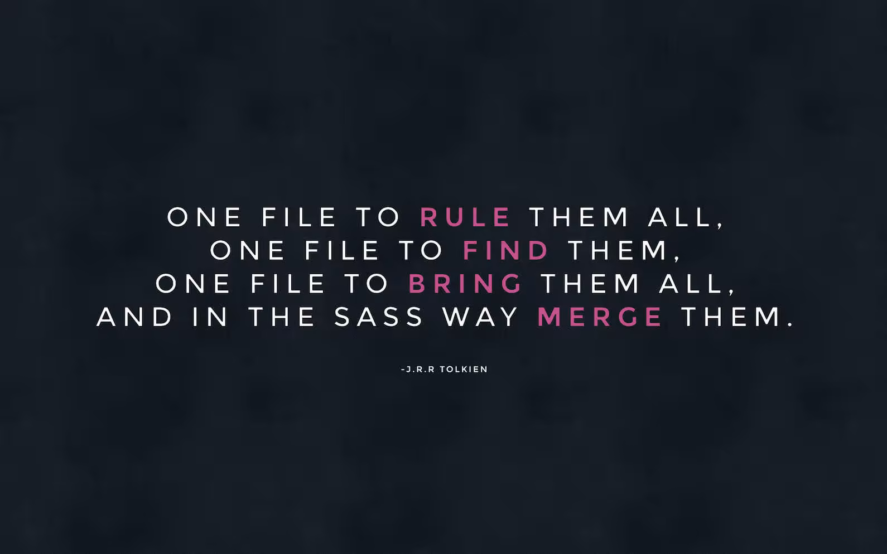

<h1 class="hero__subject--placeholder" align="center">
  <b>MAIN FILE</b>
</h1>

<div class="hero__main--placeholder" align="center">
  
  <br />
  <br />
  <q>
    <i>
    The main file (usually labelled main.scss) should be the only Sass file from the whole code base not to begin with an underscore. This file should not contain anything but @import and comments.
    <i/>
  </q>
</div>

<br/>
<br/>
<h2 class="heading__subcat-title--placeholder---v01" align="center">
   &nbsp; <b>TABLE OF CONTENTS</b> &nbsp; 
</h2>
<br/>

- [`base/`](base/)
- [`components/`](components/)
- [`layout/`](layout/)
- [`pages/`](pages/)
- [`themes/`](themes/)
- [`abstracts/`](abstracts/)
- [`vendors/`](vendors/)

<br/>
<br/>
<h2 class="heading__subcat-title--placeholder---v01" align="center">
   &nbsp; <b>DIRECTORY STRUCTURE</b> &nbsp; 
</h2>
<br/>

```bash
sass/
|
|– abstracts/
|   |– _variables.scss    # Sass Variables
|   |– _functions.scss    # Sass Functions
|   |– _mixins.scss       # Sass Mixins
|   |– _placeholders.scss # Sass Placeholders
|
|– base/
|   |– _reset.scss        # Reset/normalize
|   |– _typography.scss   # Typography rules
|   …                     # Etc.
|
|– components/
|   |– _buttons.scss      # Buttons
|   |– _carousel.scss     # Carousel
|   |– _cover.scss        # Cover
|   |– _dropdown.scss     # Dropdown
|   …                     # Etc.
|
|– layout/
|   |– _navigation.scss   # Navigation
|   |– _grid.scss         # Grid system
|   |– _header.scss       # Header
|   |– _footer.scss       # Footer
|   |– _sidebar.scss      # Sidebar
|   |– _forms.scss        # Forms
|   …                     # Etc.
|
|– pages/
|   |– _home.scss         # Home specific styles
|   |– _contact.scss      # Contact specific styles
|   …                     # Etc.
|
|– themes/
|   |– _theme.scss        # Default theme
|   |– _admin.scss        # Admin theme
|   …                     # Etc.
|
|– vendors/
|   |– _bootstrap.scss    # Bootstrap
|   |– _jquery-ui.scss    # jQuery UI
|   …                     # Etc.
|
`– main.scss              # Main Sass file
```

<br/>
<br/>
<h2 class="heading__subcat-title--placeholder---v01" align="center">
   &nbsp; <b>REFERENCE</b> &nbsp; 
</h2>
<br/>

- [base/](http://sass-guidelin.es/#base-folder)
- [components/](http://sass-guidelin.es/#components-folder)
- [layout/](http://sass-guidelin.es/#layout-folder)
- [pages/](http://sass-guidelin.es/#pages-folder)
- [themes/](http://sass-guidelin.es/#themes-folder)
- [abstracts/](http://sass-guidelin.es/#abstracts-folder)
- [vendors/](http://sass-guidelin.es/#vendors-folder)

Reference: [Sass Guidelines](http://sass-guidelin.es/) > [Architecture](http://sass-guidelin.es/#architecture) > [Main file](http://sass-guidelin.es/#main-file)
