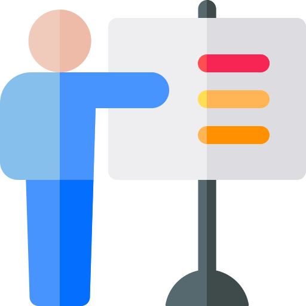
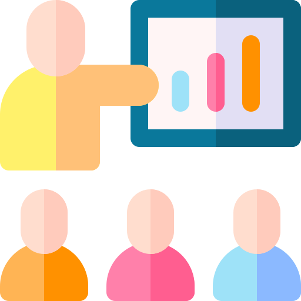

<h1 class="hero__subject--root" align="center">
  ⚒️ &nbsp; <b>PROJECT MARCEL TEUGELS</b> &nbsp; 🛠️
</h1>
 

  
  
  
  
  
  
  
  

 

  <i>"One machine can do the work of 50 ordinary men.</i>
  <i>No machine can do the work of one extraordinary men."</i>
   
   
   
   
  
   
   
   
   
  <q>
    <i>
    A personal website for Marcel Teugels, a young passionate blacksmith who mainly deals with restoration and handmade assignments.
    The website consists out of 2 main parts, a restoration area for regular repairs and a personal section for handmade creations.
    <i/>
  </q>
   
   

 
 
 
 
<h2 class="heading__subcat-title--root---v01" align="center">
   &nbsp;
  <b>TABLE OF CONTENTS</b> &nbsp;
  
</h2>

**Subcategory Title 1 Description**

---

- [ &nbsp; **TABLE OF CONTENTS** <!-- {#root-toc} -->](/table-of-contents)

  - [ &nbsp; _Essential_ <!-- {#toc-essential} -->](/table-of-contents/essential)
  - [ &nbsp; _Advanced_ <!-- {#toc-advanced} -->](/table-of-contents/advanced)
  - [ &nbsp; _Extra_ <!-- {#toc-extra} -->](/table-of-contents/extra)

- [ &nbsp; **KEY FEATURES** <!-- {#root-feat} -->](#Key_Features)

  - [ &nbsp; _Essential_ <!-- {#feat-essential} -->](#Essential)
  - [ &nbsp; _Advanced_ <!-- {#feat-advanced} -->](#Advanced)
  - [ &nbsp; _Extra_ <!-- {#feat-extra} -->](#Extra)

- [ &nbsp; **GETTING STARTED** <!-- {#root-started} -->](#Getting_Started)

  - [ &nbsp; _Prerequisites_ <!-- {#started-prereq} -->](#Prerequisites)
  - [ &nbsp; _Installation_ <!-- {#started-install} -->](#Installation)
  - [ &nbsp; _Usage_ <!-- {#started-usage} -->](#Usage)

- [ &nbsp; **COMMON CONVENTIONS** <!-- {#root-com-convens} -->](#Common_Conventions)

  - [ &nbsp; _Rules_ <!-- {#com-convens-rules} -->](#Rules)
  - [ &nbsp; _Styles_ <!-- {#com-convens-styles} -->](#Styles)
  - [ &nbsp; _Semver_ <!-- {#com-convens-semver} -->](#Semver)

- [ &nbsp; **PROJECT MANAGEMENT** <!-- {#root-project-mgmt} -->](#Project_Management)

  - [ &nbsp; _Git & Github_ <!-- {#project-mgmt-git} -->](#Git_&_Github)
  - [ &nbsp; _Architecture & Layout_ <!-- {#project-mgmt-architecture} -->](#Architecture_&_Layout)
  - [ &nbsp; _Technology Stack & Tools_ <!-- {#project-mgmt-tech-stack} -->](#Technology_Stack_&_Tools)
  - [ &nbsp; _Roadmap & Changelog_ <!-- {#project-mgmt-roadmap} -->](#Roadmap_&_Changelog)
  - [ &nbsp; _Configuration & Settings_ <!-- {#project-mgmt-config} -->](#Configuration_&_Settings)
  - [ &nbsp; _NPM & Extensions_ <!-- {#project-mgmt-npm} -->](#NPM_&_VScode)
  - [ &nbsp; _Deployment & Release_ <!-- {#project-mgmt-deployment} -->](#Deployment_&_Release)

- [ &nbsp; **AUTHORS** <!-- {#root-authors} -->](#Authors)

  - [ &nbsp; _Introduction_ <!-- {#authors-} -->](#Introduction)
  - [ &nbsp; _Responsibilities & Abilities_ <!-- {#authors-respons} -->](#Responsibilities_&_Abilities)
  - [ &nbsp; _Contact Info_ <!-- {#authors-contact-info} -->](#contact_Info)

- [ &nbsp; **LICENSE** <!-- {#root-license} -->](#License)

  - [ &nbsp; _Legal Information_ <!-- {#license-legal-info} -->](#legal_information)

 

---

  
<b>Subject Extended ⚊ Placeholder title</b>

---

 

Occaecat occaecat enim sint adipisicing amet pariatur. Reprehenderit id nisi incididunt labore dolor id. Voluptate proident tempor incididunt quis consequat nostrud. Aliquip enim magna excepteur aliqua magna. Incididunt enim quis elit cillum deserunt.

 

