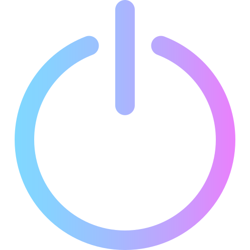

<h1 class="hero__subject--root" align="center">
  ⚒️ &nbsp; <b>PROJECT MARCEL TEUGELS</b> &nbsp; 🛠️
</h1>
 

  
  
  
  
  
  
  
  

 

  <i>
  "One machine can do the work of 50 ordinary men. No machine can do the work of one extraordinary men."
  </i>
   
   
   
   
  
   
   
   
   
  <q>
    <i>
    A personal website for Marcel Teugels, a young passionate blacksmith who mainly deals with restoration and handmade assignments.
    The website consists out of 2 main parts, a restoration area for regular repairs and a personal section for handmade creations.
    <i/>
  </q>

 
 
 
 
<h2 class="heading__subcat-title--root---v01" align="center">
   &nbsp;
  <b>TABLE OF CONTENTS</b> &nbsp;
  
</h2>
 

- [ &nbsp; **FEATURES** <!-- {#root-feat} -->](../../docs/toc/features)

  - [ &nbsp; _Essential_ <!-- {#feat-essential} -->](../../docs/toc/features/essentialS)
  - [ &nbsp; _Advanced_ <!-- {#feat-advanced} -->](../../docs/toc/features/advanced)
  - [ &nbsp; _Extra_ <!-- {#feat-extra} -->](../../docs/toc/features/extra)

- [ &nbsp; **GETTING STARTED** <!-- {#root-started} -->](../../docs/toc/getting-started)

  - [ &nbsp; _Prerequisites_ <!-- {#started-prereq} -->](../../docs/toc/getting-started/prerequisites)
  - [ &nbsp; _Installation_ <!-- {#started-install} -->](../../docs/toc/getting-started/installation)
  - [ &nbsp; _Usage_ <!-- {#started-usage} -->](../../docs/toc/getting-started/usage)

- [ &nbsp; **COMMON CONVENTIONS** <!-- {#root-com-convens} -->](../../docs/toc/common-conventions)

  - [ &nbsp; _Rules_ <!-- {#com-convens-rules} -->](../../docs/toc/common-conventions/rules)
  - [ &nbsp; _Styles_ <!-- {#com-convens-styles} -->](../../docs/toc/common-conventions/styles)
  - [ &nbsp; _Semver_ <!-- {#com-convens-semver} -->](../../docs/toc/common-conventions/semver)

- [ &nbsp; **PROJECT MANAGEMENT** <!-- {#root-project-mgmt} -->](../../docs/toc/project-management)

  - [ &nbsp; _Git & Github_ <!-- {#project-mgmt-git} -->](../../docs/toc/project-management/git-&-github)
  - [ &nbsp; _Architecture & Layout_ <!-- {#project-mgmt-architecture} -->](../../docs/toc/project-management/architecture-&-layout)
  - [ &nbsp; _Technology Stack & Tools_ <!-- {#project-mgmt-tech-stack} -->](../../docs/toc/project-management/technology-stack-&-tools)
  - [ &nbsp; _Roadmap & Changelog_ <!-- {#project-mgmt-roadmap} -->](../../docs/toc/project-management/roadmap-&-changelog)
  - [ &nbsp; _Configuration & Settings_ <!-- {#project-mgmt-config} -->](../../docs/toc/project-management/configuration-&-settings)
  - [ &nbsp; _NPM & Extensions_ <!-- {#project-mgmt-npm} -->](../../docs/toc/project-management/npm-&-extensions)
  - [ &nbsp; _Deployment & Release_ <!-- {#project-mgmt-deployment} -->](../../docs/toc/project-management/deployment-&-release)

- [ &nbsp; **AUTHORS** <!-- {#root-authors} -->](../../docs/toc/authors)

  - [ &nbsp; _Introduction_ <!-- {#authors-} -->](../../docs/toc/authors/introduction)
  - [ &nbsp; _Responsibilities & Abilities_ <!-- {#authors-respons} -->](../../docs/toc/authors/responsibilities-&-abilities)
  - [ &nbsp; _Contact Info_ <!-- {#authors-contact-info} -->](../../docs/toc/authors/contact-info)

- [ &nbsp; **LICENSE** <!-- {#root-license} -->](../../docs/toc/license)

  - [ &nbsp; _Legal Information_ <!-- {#license-legal-info} -->](../../docs/toc/license/legal-information)
