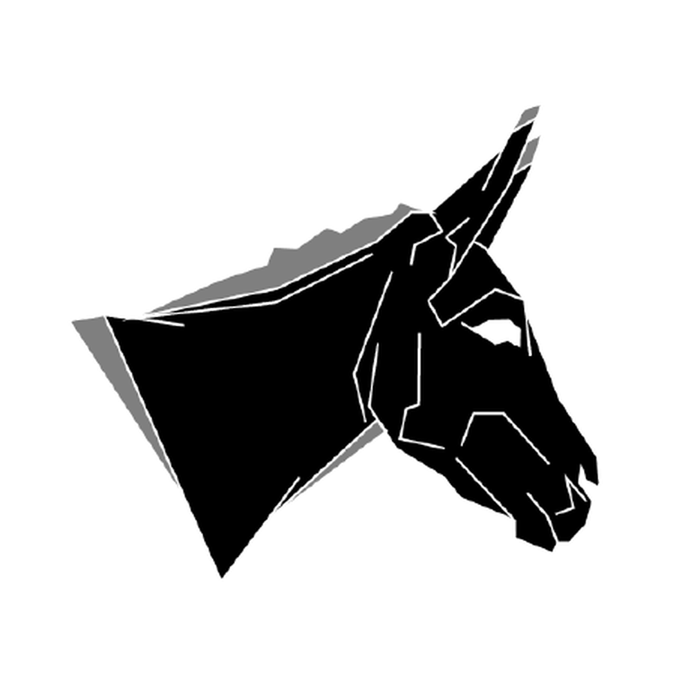
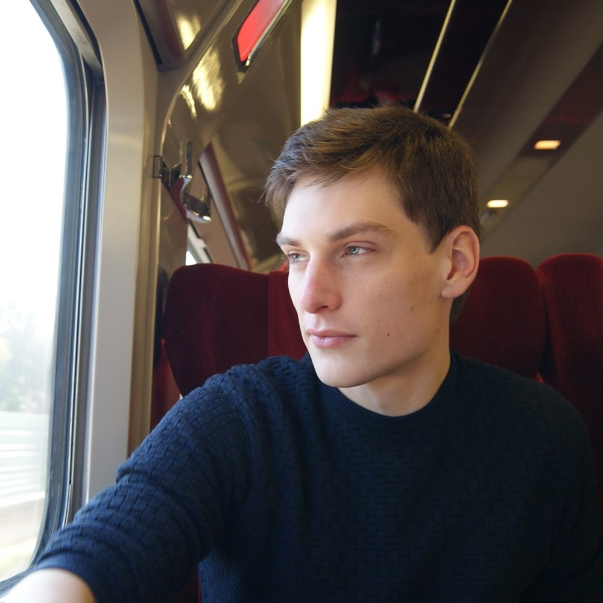
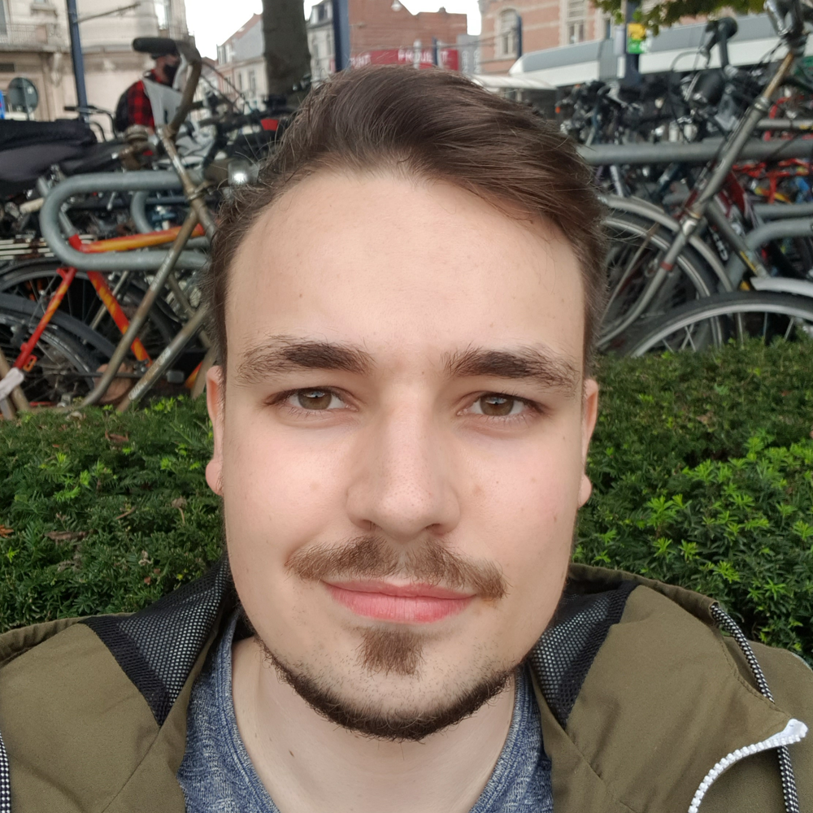
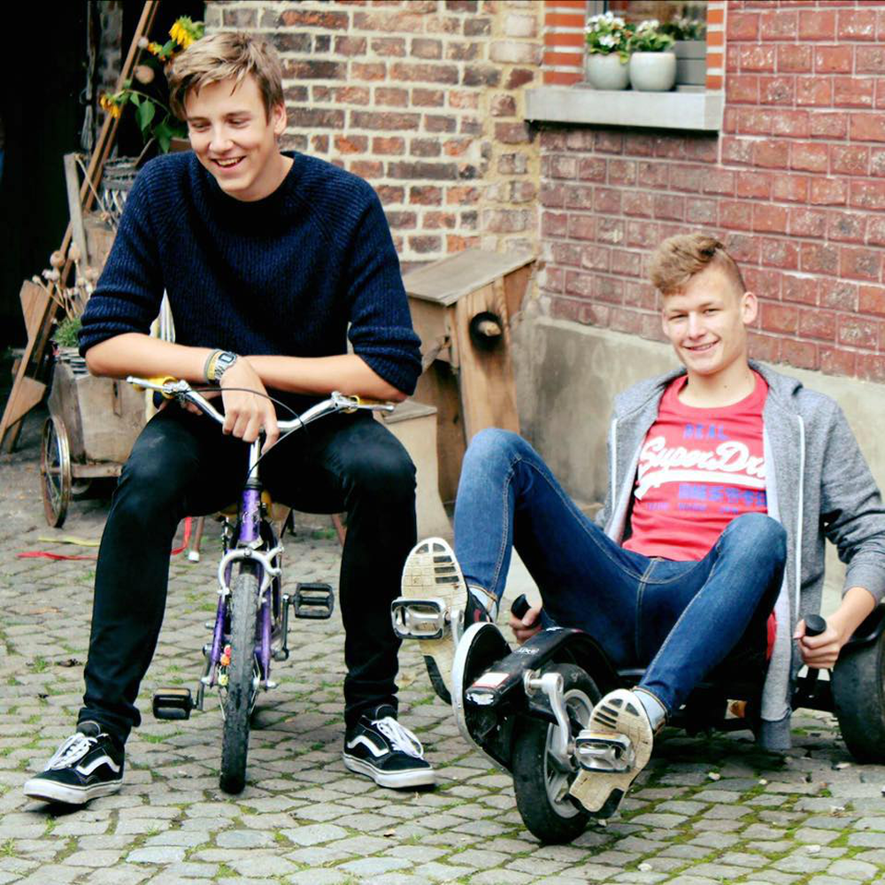
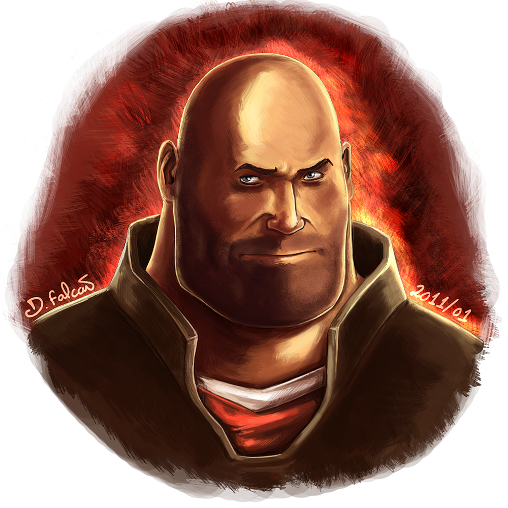

<h1 class="hero__subject--introduction" align="center">
   &nbsp;
  <b>AUTHORS/INTRODUCTION</b> &nbsp;
  
</h1>

  <i>
  "A general and short description of all the authors."
  </i>
   
   
   
   
  
   
   
   
   
  <q>
    <i>
    Nostrud Lorem tempor anim aliquip minim officia labore culpa adipisicing excepteur fugiat. Ut eu laborum culpa dolor aliquip. Culpa occaecat excepteur proident est ullamco cillum anim deserunt cupidatat culpa sint voluptate commodo esse. Proident velit tempor velit nisi cupidatat. Qui velit tempor irure ullamco sint ad deserunt nulla nulla est dolor irure.
    <i/>
  </q>

 
 
 
 
<h2 class="heading__subcat-title--introduction---v01" align="center">
   &nbsp; <b>PLACEHOLDER SUBCATEGORY TITLE 1</b> &nbsp; 
</h2>
 

| Photo                                                                                                 | Full Name            | Team Proffesion                     | Social Media Accounts                                    | Email Address                 | Current Main Focus                                                                                      |
| ----------------------------------------------------------------------------------------------------- | -------------------- | ----------------------------------- | -------------------------------------------------------- | ----------------------------- | ------------------------------------------------------------------------------------------------------- |
|  | **Korneel Eeckhout** | _Prestigious Project Patriarch_     | [Github:Korneel], [Linkedin:Korneel], [Facebook:Korneel] | _..._                         |  Project Oversight |
|     | **Emiel Teugels**    | _Driven Database Director_          | [Github:Emiel], [Linkedin:Emiel], [Facebook:Emiel]       | _emiel_teugels@hotmail.com_   |  Datbase Management   |
|     | **Raf Vergauwen**    | _Glorious Git Governor_             | [Github:Raf], [Linkedin:Raf], [Facebook:Raf]             | _vergauwen.r@outlook.com_     |  Git Management              |
|  | **Kenneth Blondeel** | _Illustrious Illustration Inventor_ | [Github:Kenneth], [Linkedin:Kenneth], [Facebook:Kenneth] | _kennethblondeel@hotmail.com_ |  Design Management       |
|    | **Lins Timperman**   | _Suitable Support Sidekick_         | [Github:Lins], [Linkedin:Lins], [Facebook:Lins]          | _lins.timperman@gmail.com_    |  Universal Support  |

 

[github:korneel]: https://github.com/pienter-tech
[github:emiel]: https://github.com/EmielTeugels
[github:raf]: https://github.com/raf-vergauwen
[github:kenneth]: https://github.com/KennethBlondeel
[github:lins]: https://github.com/LinsTimperman
[linkedin:korneel]: https://linkedin.com/pienter-tech
[linkedin:emiel]: https://linkedin.com/EmielTeugels
[linkedin:raf]: https://linkedin.com/raf-vergauwen
[linkedin:kenneth]: https://linkedin.com/KennethBlondeel
[linkedin:lins]: https://linkedin.com/LinsTimperman
[facebook:korneel]: https://facebook.com/pienter-tech
[facebook:emiel]: https://facebook.com/EmielTeugels
[facebook:raf]: https://facebook.com/raf-vergauwen
[facebook:kenneth]: https://facebook.com/KennethBlondeel
[facebook:lins]: https://facebook.com/LinsTimperman

 

---

  
<i>Subject Extended ⚊ Placeholder title</i>

---

 

Occaecat occaecat enim sint adipisicing amet pariatur. Reprehenderit id nisi incididunt labore dolor id. Voluptate proident tempor incididunt quis consequat nostrud. Aliquip enim magna excepteur aliqua magna. Incididunt enim quis elit cillum deserunt.

 

